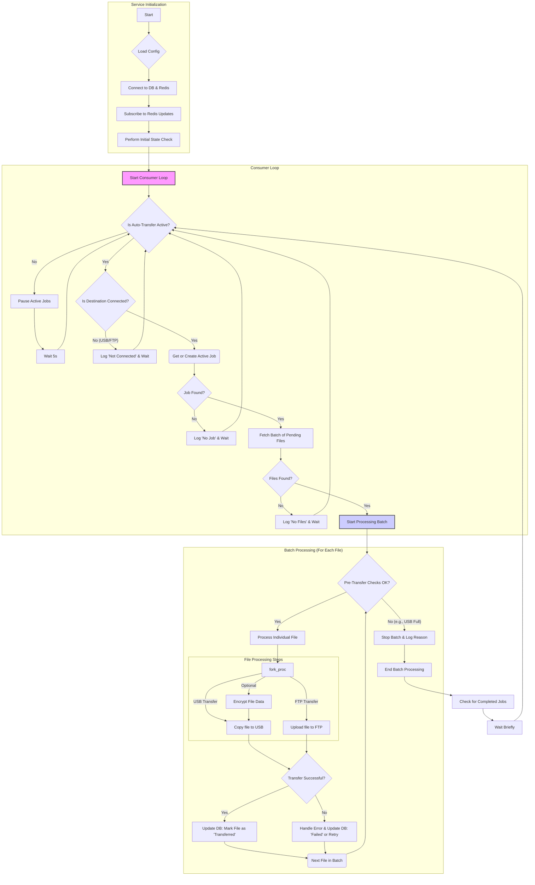
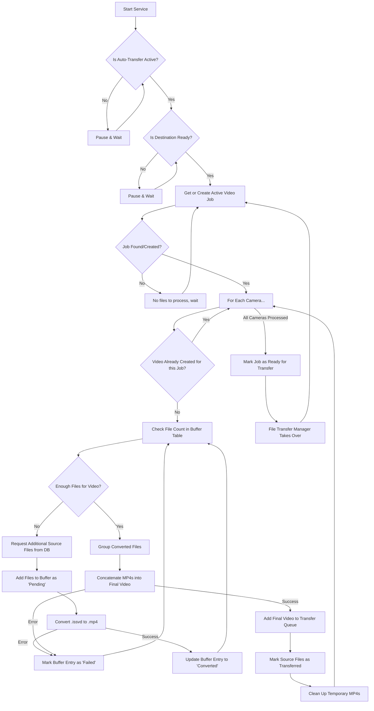
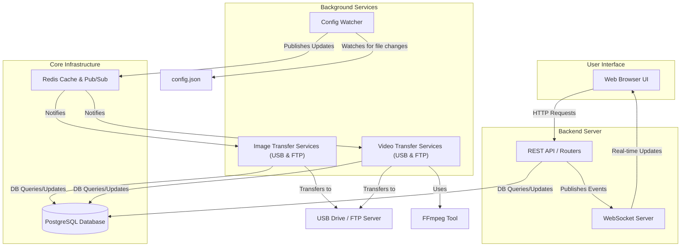
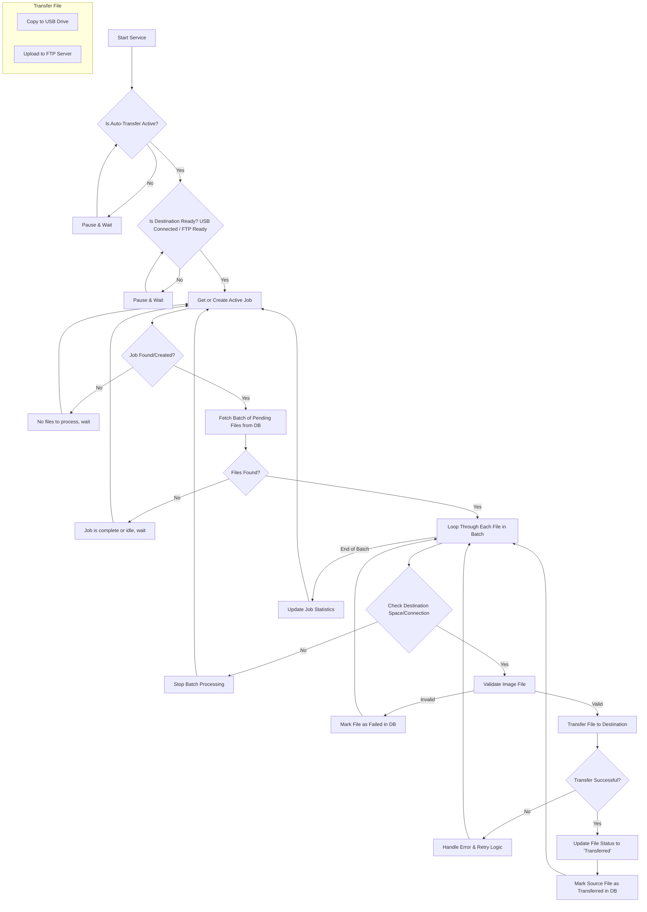
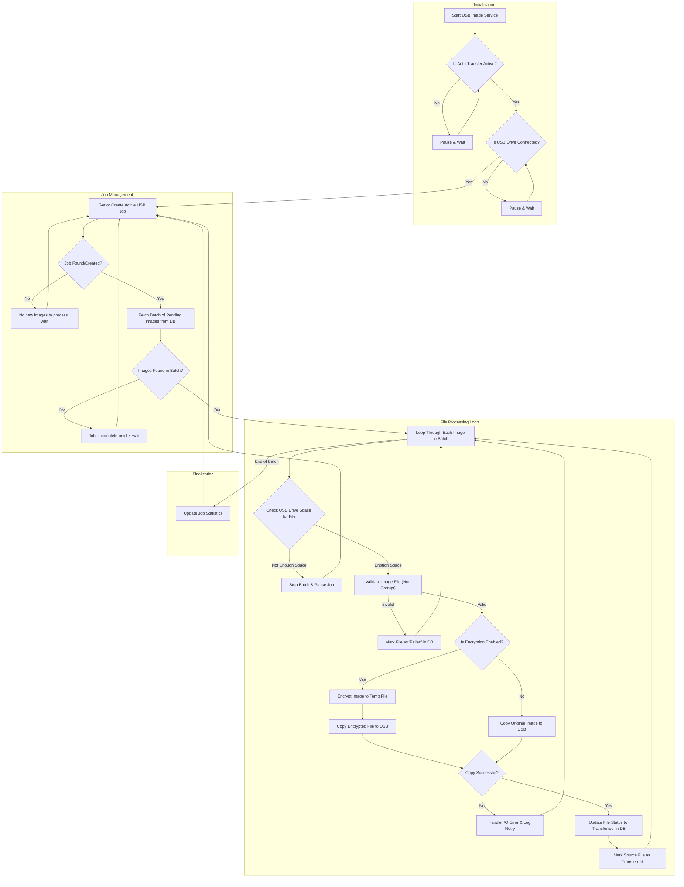

```mermaid

graph TD
    subgraph Service Initialization
        A[Start] --> B{Load Config};
        B --> C[Connect to DB & Redis];
        C --> D[Subscribe to Redis Updates];
        D --> E[Perform Initial State Check];
    end

    E --> F[Start Consumer Loop];

    subgraph Consumer Loop
        F --> G{Is Auto-Transfer Active?};
        G -- No --> H[Pause Active Jobs];
        H --> I[Wait 5s];
        I --> G;

        G -- Yes --> J{Is Destination Connected?};
        J -- No (USB/FTP) --> K[Log 'Not Connected' & Wait];
        K --> G;

        J -- Yes --> L(Get or Create Active Job);
        L --> M{Job Found?};
        M -- No --> N[Log 'No Job' & Wait];
        N --> G;

        M -- Yes --> O[Fetch Batch of Pending Files];
        O --> P{Files Found?};
        P -- No --> Q[Log 'No Files' & Wait];
        Q --> G;

        P -- Yes --> R[Start Processing Batch];
    end

    subgraph "Batch Processing (For Each File)"
        R --> S{Pre-Transfer Checks OK?};
        S -- "No (e.g., USB Full)" --> T[Stop Batch & Log Reason];
        T --> U[End Batch Processing];

        S -- Yes --> V[Process Individual File];
        V --> fork_proc;

        subgraph "File Processing Steps"
            fork_proc -- USB Transfer --> W_USB[Copy file to USB];
            fork_proc -- FTP Transfer --> W_FTP[Upload file to FTP];
            fork_proc -- Optional --> W_Encrypt[Encrypt File Data];
        end

        W_USB --> X{Transfer Successful?};
        W_FTP --> X;
        W_Encrypt --> W_USB;

        X -- Yes --> Y[Update DB: Mark File as 'Transferred'];
        X -- No --> Z[Handle Error & Update DB: 'Failed' or Retry];

        Y --> AA(Next File in Batch);
        Z --> AA;
        AA --> S;
    end

    U --> BB[Check for Completed Jobs];
    BB --> CC[Wait Briefly];
    CC --> G;

    %% Styling
    style F fill:#f9f,stroke:#333,stroke-width:2px
    style R fill:#ccf,stroke:#333,stroke-width:2px


```



```mermaid
graph TD
    A[Start Service] --> B{Is Auto-Transfer Active?};
    B -- No --> C[Pause & Wait];
    C --> B;
    B -- Yes --> D{Is Destination Ready?};
    D -- No --> E[Pause & Wait];
    E --> D;

    D -- Yes --> F[Get or Create Active Video Job];
    F --> G{Job Found/Created?};
    G -- No --> H[No files to process, wait];
    H --> F;

    G -- Yes --> I[For Each Camera...];
    I --> J{Video Already Created for this Job?};
    J -- Yes --> I;
    J -- No --> K[Check File Count in Buffer Table];
    K --> L{Enough Files for Video?};
    L -- No --> M[Request Additional Source Files from DB];
    M --> N[Add Files to Buffer as 'Pending'];
    N --> O[Convert .issvd to .mp4];
    O -- Error --> P[Mark Buffer Entry as 'Failed'];
    P --> K;
    O -- Success --> Q[Update Buffer Entry to 'Converted'];
    Q --> K;

    L -- Yes --> R[Group Converted Files];
    R --> S[Concatenate MP4s into Final Video];
    S -- Error --> P;
    S -- Success --> T[Add Final Video to Transfer Queue];
    T --> U[Mark Source Files as Transferred];
    U --> V[Clean Up Temporary MP4s];
    V --> I;

    I -- All Cameras Processed --> W[Mark Job as Ready for Transfer];
    W --> X[File Transfer Manager Takes Over];
    X --> F;


```



```mermaid

graph TD
    subgraph User Interface
        UI[Web Browser UI]
    end

    subgraph Backend Server
        direction LR
        API[REST API / Routers]
        WSS[WebSocket Server]
    end

    subgraph Core Infrastructure
        direction LR
        DB[(PostgreSQL Database)]
        REDIS[Redis Cache & Pub/Sub]
    end

    subgraph Background Services
        direction TB
        CW[Config Watcher]
        ITS["Image Transfer Services (USB & FTP)"]
        VTS["Video Transfer Services (USB & FTP)"]
    end

    UI -- HTTP Requests --> API
    API -- DB Queries/Updates --> DB
    WSS -- Real-time Updates --> UI
    API -- Publishes Events --> WSS

    CW -- Watches for file changes --> FS[config.json]
    CW -- Publishes Updates --> REDIS

    REDIS -- Notifies --> ITS
    REDIS -- Notifies --> VTS
    ITS -- DB Queries/Updates --> DB
    VTS -- DB Queries/Updates --> DB

    ITS -- Transfers to --> DEST1[USB Drive / FTP Server]
    VTS -- Transfers to --> DEST1

    VTS -- Uses --> FFMPEG[FFmpeg Tool]


```



```mermaid
graph TD
    A[Start Service] --> B{Is Auto-Transfer Active?};
    B -- No --> C[Pause & Wait];
    C --> B;
    B -- Yes --> D{Is Destination Ready? USB Connected / FTP Ready};
    D -- No --> E[Pause & Wait];
    E --> D;

    D -- Yes --> F[Get or Create Active Job];
    F --> G{Job Found/Created?};
    G -- No --> H[No files to process, wait];
    H --> F;
    G -- Yes --> I[Fetch Batch of Pending Files from DB];
    I --> J{Files Found?};
    J -- No --> K[Job is complete or idle, wait];
    K --> F;

    J -- Yes --> L[Loop Through Each File in Batch];
    L --> M{Check Destination Space/Connection};
    M -- No --> N[Stop Batch Processing];
    N --> F;

    M -- Yes --> O[Validate Image File];
    O -- Invalid --> P[Mark File as Failed in DB];
    P --> L;

    O -- Valid --> Q[Transfer File to Destination];
    subgraph "Transfer File"
        direction LR
        Q_USB[Copy to USB Drive]
        Q_FTP[Upload to FTP Server]
    end
    Q --> R{Transfer Successful?};
    R -- No --> S[Handle Error & Retry Logic];
    S --> L;

    R -- Yes --> T[Update File Status to 'Transferred'];
    T --> U[Mark Source File as Transferred in DB];
    U --> L;

    L -- End of Batch --> V[Update Job Statistics];
    V --> F;

```



```mermaid
graph TD
    subgraph Initialization
        A[Start USB Image Service] --> B{Is Auto-Transfer Active?};
        B -- No --> C[Pause & Wait];
        C --> B;
        B -- Yes --> D{Is USB Drive Connected?};
        D -- No --> E[Pause & Wait];
        E --> D;
    end

    subgraph Job Management
        D -- Yes --> F[Get or Create Active USB Job];
        F --> G{Job Found/Created?};
        G -- No --> H[No new images to process, wait];
        H --> F;
        G -- Yes --> I[Fetch Batch of Pending Images from DB];
        I --> J{Images Found in Batch?};
        J -- No --> K[Job is complete or idle, wait];
        K --> F;
    end

    subgraph File Processing Loop
        J -- Yes --> L[Loop Through Each Image in Batch];
        L --> M{Check USB Drive Space for File};
        M -- Not Enough Space --> N[Stop Batch & Pause Job];
        N --> F;

        M -- Enough Space --> O["Validate Image File (Not Corrupt)"];
        O -- Invalid --> P[Mark File as 'Failed' in DB];
        P --> L;

        O -- Valid --> Q{Is Encryption Enabled?};
        Q -- Yes --> R[Encrypt Image to Temp File];
        R --> S[Copy Encrypted File to USB];
        Q -- No --> T[Copy Original Image to USB];
        
        S --> U{Copy Successful?};
        T --> U;

        U -- No --> V[Handle I/O Error & Log Retry];
        V --> L;
        U -- Yes --> W[Update File Status to 'Transferred' in DB];
        W --> X[Mark Source File as Transferred];
        X --> L;
    end

    subgraph Finalization
        L -- End of Batch --> Y[Update Job Statistics];
        Y --> F;
    end

```


```mermaid

```