# Activity Diagrams - Data Transfer Services

This directory contains comprehensive activity diagrams for the main data transfer services in the Tahakom PM2 application.

## Service Diagrams

### 1. [FTP Image Transfer Service](./autoFTPImageTransferService-activity.md)
**File**: `autoFTPImageTransferService.js`

Handles automatic transfer of image files via FTP protocol with batch processing and error recovery.

**Key Features:**
- FTP image file batch processing (50 files per batch)
- Redis pub/sub configuration management
- Image format validation
- FTP connection monitoring
- Transfer metrics publishing
- Error handling with retry logic

### 2. [Unified Video Transfer Service](./refactored_autoVideoTransferEDAMicroservice-activity.md)
**File**: `refactored_autoVideoTransferEDAMicroservice.js`

Comprehensive EventEmitter-based video processing and transfer service for USB storage with advanced job management.

**Key Features:**
- Multi-camera video processing pipeline
- Scheduled vs immediate transfer modes
- Advanced job management with UUID tracking
- File conversion, grouping, and video creation
- Drive space validation
- Concurrent processing loops (main, cleanup, buffer monitoring)
- Encryption support
- Real-time metrics publishing

### 3. [FTP Video Transfer Service](./autoFtpVideoTransferService-activity.md)
**File**: `autoFtpVideoTransferService.js`

FTP-specific video processing and transfer service with connection monitoring and scheduling capabilities.

**Key Features:**
- FTP-specific video processing pipeline
- FTP connection health monitoring
- Schedule-based transfer control
- FTP buffer management
- Multi-camera parallel processing
- Dynamic FTP configuration reloading
- Transfer window management
- FTP-specific error recovery

## Architecture Overview

```mermaid
graph TB
    subgraph "Image Transfer"
        A[FTP Image Transfer Service]
        A --> A1[Image Validation]
        A --> A2[FTP Upload]
        A --> A3[Batch Processing]
    end
    
    subgraph "Video Transfer - USB"
        B[Unified Video Transfer Service]
        B --> B1[Video Processing]
        B --> B2[Job Management]
        B --> B3[USB Transfer]
        B --> B4[Drive Monitoring]
    end
    
    subgraph "Video Transfer - FTP"
        C[FTP Video Transfer Service]
        C --> C1[Video Processing]
        C --> C2[FTP Job Management]
        C --> C3[FTP Transfer]
        C --> C4[Connection Monitoring]
    end
    
    subgraph "Shared Infrastructure"
        D[Redis Pub/Sub]
        E[PostgreSQL Database]
        F[Configuration Management]
        G[Metrics Publishing]
    end
    
    A --> D
    A --> E
    A --> F
    A --> G
    
    B --> D
    B --> E
    B --> F
    B --> G
    
    C --> D
    C --> E
    C --> F
    C --> G
    
    classDef imageService fill:#e3f2fd,stroke:#1565c0,stroke-width:2px
    classDef usbVideoService fill:#f3e5f5,stroke:#4a148c,stroke-width:2px
    classDef ftpVideoService fill:#e8f5e8,stroke:#2e7d32,stroke-width:2px
    classDef infrastructure fill:#fff3e0,stroke:#e65100,stroke-width:2px
    
    class A,A1,A2,A3 imageService
    class B,B1,B2,B3,B4 usbVideoService
    class C,C1,C2,C3,C4 ftpVideoService
    class D,E,F,G infrastructure
```

## Common Patterns

All three services share several common architectural patterns:

### 1. **Service Initialization**
- Database connection setup (PostgreSQL)
- Redis client initialization
- Configuration loading
- External service initialization
- Event subscription setup

### 2. **Main Processing Loops**
- Continuous processing loops
- Configuration state checking
- Conditional processing based on service state
- Error handling and recovery
- Metrics publishing

### 3. **Configuration Management**
- Redis pub/sub for real-time configuration updates
- Dynamic service state changes
- Transfer enable/disable functionality
- Schedule management (where applicable)

### 4. **Error Handling**
- Graceful error recovery
- Connection failure handling
- File processing error management
- Retry logic with exponential backoff
- Logging and metrics for debugging

### 5. **Resource Management**
- Connection pooling
- Temporary file cleanup
- Memory management
- Graceful shutdown procedures

## Deployment Considerations

These services are designed to run as separate PM2 processes with the following characteristics:

- **Independence**: Each service can run independently
- **Resilience**: Automatic restart on failure via PM2
- **Monitoring**: Comprehensive metrics and logging
- **Configuration**: Hot-reload configuration changes via Redis
- **Scalability**: Services can be scaled independently based on workload

For detailed workflow information, refer to the individual service diagrams linked above.
