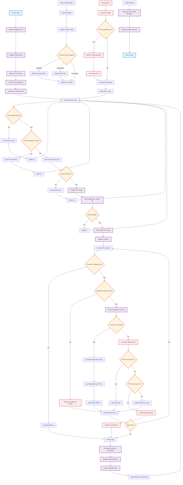

# FTP Image Transfer Service - Activity Diagram

## Overview
This diagram shows the main workflow of the FTP Image Transfer Service (`autoFTPImageTransferService.js`), which handles automatic transfer of image files via FTP protocol.

## Activity Diagram

## Key Components

### Main Processing Flow
1. **Service Initialization**: Sets up database, Redis connections, and FTP services
2. **Configuration Management**: Loads and monitors FTP configuration changes
3. **Consumer Loop**: Main processing loop that handles file transfer batches
4. **File Processing**: Validates and transfers individual image files via FTP
5. **Error Handling**: Manages different types of errors with appropriate recovery strategies

### Key Decision Points
- **Auto Transfer Active**: Checks if the service should be processing files
- **FTP Connection Ready**: Validates FTP connection status before processing
- **File Format Validation**: Ensures only supported image formats are processed
- **Error Type Classification**: Different handling for file not found vs FTP connection errors

### Metrics and Monitoring
- Real-time progress tracking during batch processing
- Transfer statistics (processed count, failed count, throughput)
- Redis metrics publishing for dashboard integration
- Job completion status tracking

### Configuration Updates
- Redis pub/sub for real-time configuration changes
- Dynamic FTP configuration reloading
- Transfer activation/deactivation handling

## Error Recovery Strategies
1. **File Not Found**: Mark as failed and continue
2. **FTP Connection Errors**: Disconnect FTP and retry in next cycle
3. **General Errors**: Apply retry logic with exponential backoff
4. **Service Errors**: Longer delays before retry (10s)

## Performance Considerations
- Batch processing (50 files per batch)
- Small delays between FTP uploads (100ms) to prevent server overload
- Progress logging every 5 files for large batches
- Configurable retry strategies for failed transfers
