# Unified Video Transfer Service - Activity Diagram

## Overview
This diagram shows the main workflow of the Unified Video Transfer Service (`refactored_autoVideoTransferEDAMicroservice.js`), which handles automatic video processing, creation, and transfer to USB storage with advanced job management and scheduling capabilities.

## Activity Diagram

```mermaid
flowchart TD
    A[Service Start] --> B[Initialize Database Pool]
    B --> C[Initialize Redis Connections]
    C --> D[Ensure Video Temp Directory]
    D --> E[Initialize External Services]
    E --> F[Subscribe to Redis Events]
    F --> G[Load Service Configuration]
    G --> H[Update Drive Information]
    H --> I[Emit Start Event]
    
    I --> J[Start Processing Loop]
    I --> K[Start Cleanup Loop]
    I --> L[Start Buffer Monitoring Loop]
    
    %% Main Processing Loop
    J --> M{Should Stop?}
    M -->|Yes| N[End Processing]
    
    M -->|No| O{Video Transfer Paused?}
    O -->|Yes| P[Log Transfer Disabled]
    P --> Q[Sleep 2s]
    Q --> J
    
    O -->|No| R{Is Processing?}
    R -->|Yes| S[Sleep 2s]
    S --> J
    
    R -->|No| T[Set Processing True]
    T --> U{Video Transfer Enabled?}
    U -->|No| V[Log Transfer Disabled]
    V --> W[Set Processing False]
    W --> X[Sleep 5s]
    X --> J
    
    U -->|Yes| Y{Scheduled Transfer?}
    Y -->|Yes| Z{In Scheduled Window?}
    Z -->|No| AA[Log Waiting for Window]
    AA --> BB[Update Schedule Status]
    BB --> W
    
    Z -->|Yes| CC[Log In Scheduled Window]
    Y -->|No| CC
    
    CC --> DD{Drive Ready?}
    DD -->|No| EE[Log Drive Status]
    EE --> W
    
    DD -->|Yes| FF[Get Existing Uncompleted Jobs]
    FF --> GG{Jobs Found?}
    GG -->|Yes| HH[Get Newest Job]
    HH --> II[Handle Job Processing]
    
    GG -->|No| JJ[Check File Availability]
    JJ --> KK{Files Available?}
    KK -->|No| LL[Log No Files Available]
    LL --> W
    
    KK -->|Yes| MM[Create New Job with UUID]
    MM --> NN[Log New Job Created]
    NN --> II
    
    II --> OO[Publish Job Start Metrics]
    OO --> PP[Process All Cameras in Parallel]
    
    %% Single Camera Processing
    PP --> QQ[For Each Camera]
    QQ --> RR{Video in Transfer Queue?}
    RR -->|Yes| SS[Check Status]
    SS --> TT{Status = Pending?}
    TT -->|Yes| UU[Emit Start Transfer]
    TT -->|No| VV[Continue to Next Camera]
    RR -->|No| WW[Get Camera File Counts]
    
    WW --> XX{Enough Files for Video?}
    XX -->|No| YY{Pending Files Available?}
    YY -->|Yes| ZZ[Process Pending Records]
    ZZ --> AAA[Convert Files]
    YY -->|No| BBB[Request Additional Files]
    BBB --> CCC[Add to Buffer as Pending]
    CCC --> AAA
    
    XX -->|Yes| DDD{Enough Converted Files?}
    DDD -->|Yes| EEE[Group Files by Camera]
    DDD -->|No| AAA
    
    EEE --> FFF{Enough Grouped Files?}
    FFF -->|No| AAA
    FFF -->|Yes| GGG[Validate Processing Space]
    GGG --> HHH{Space Available?}
    HHH -->|No| III[Log Space Issue]
    III --> VV
    
    HHH -->|Yes| JJJ[Create Video from Buffer]
    JJJ --> KKK[Publish Video Created Metrics]
    KKK --> LLL[Add Video to Transfer Queue]
    LLL --> MMM[Mark Camera as Processed]
    MMM --> NNN[Update Job Stats]
    NNN --> OOO[Remove Processing Markers]
    OOO --> UU
    
    UU --> VV
    VV --> PPP{More Cameras?}
    PPP -->|Yes| QQ
    PPP -->|No| QQQ[All Cameras Processed]
    
    AAA --> RRR[Update Job Status to Pending]
    RRR --> VV
    
    QQQ --> W
    
    %% Transfer to Storage Loop (Event-driven)
    SSS[Start Transfer Event] --> TTT{Should Stop?}
    TTT -->|Yes| UUU[End Transfer]
    
    TTT -->|No| VVV{Transfer Paused?}
    VVV -->|Yes| WWW[Log Transfer Disabled]
    WWW --> UUU
    
    VVV -->|No| XXX{Scheduled Transfer Check}
    XXX -->|Outside Window| YYY[Log Outside Window]
    YYY --> UUU
    
    XXX -->|In Window| ZZZ{Transfer Already Running?}
    ZZZ -->|Yes| AAAA[Log Already Running]
    AAAA --> UUU
    
    ZZZ -->|No| BBBB[Set Transfer Running True]
    BBBB --> CCCC{Drive Ready?}
    CCCC -->|No| DDDD[Log Drive Not Ready]
    DDDD --> EEEE[Set Transfer Running False]
    EEEE --> UUU
    
    CCCC -->|Yes| FFFF[Get Pending Transfer File]
    FFFF --> GGGG{File Available?}
    GGGG -->|No| EEEE
    
    GGGG -->|Yes| HHHH[Publish Transfer Start Metrics]
    HHHH --> IIII[Transfer File to Storage]
    IIII --> JJJJ{Transfer Successful?}
    JJJJ -->|Yes| KKKK[Mark Source Files as Transferred]
    KKKK --> LLLL[Cleanup Temp Video File]
    LLLL --> MMMM[Check Job Completion]
    MMMM --> NNNN[Publish Success Metrics]
    NNNN --> EEEE
    
    JJJJ -->|No| OOOO[Publish Error Metrics]
    OOOO --> PPPP[Handle Transfer Error]
    PPPP --> QQQQ{Should Stop Processing?}
    QQQQ -->|Yes| RRRR[Set Should Stop Processing]
    RRRR --> SSSS[Update Drive Info]
    QQQQ -->|No| EEEE
    SSSS --> EEEE
    
    %% Cleanup Loop
    K --> TTTT{Should Stop?}
    TTTT -->|Yes| UUUU[End Cleanup]
    
    TTTT -->|No| VVVV{Transfer Paused?}
    VVVV -->|Yes| WWWW[Log Cleanup Disabled]
    WWWW --> XXXX[Sleep 5 minutes]
    XXXX --> K
    
    VVVV -->|No| YYYY{Scheduled Transfer Check}
    YYYY -->|Outside Window| ZZZZ[Skip Cleanup Outside Window]
    ZZZZ --> XXXX
    
    YYYY -->|In Window| AAAAA[Emit Cleanup Event]
    AAAAA --> BBBBB[Run All Cleanup Tasks]
    BBBBB --> XXXX
    
    %% Buffer Monitoring Loop
    L --> CCCCC{Should Stop?}
    CCCCC -->|Yes| DDDDD[End Buffer Monitoring]
    
    CCCCC -->|No| EEEEE{Transfer Paused?}
    EEEEE -->|Yes| FFFFF[Log Buffer Monitoring Disabled]
    FFFFF --> GGGGG[Sleep 30s]
    GGGGG --> L
    
    EEEEE -->|No| HHHHH{Scheduled Transfer Check}
    HHHHH -->|Outside Window| IIIII[Skip Buffer Monitoring]
    IIIII --> GGGGG
    
    HHHHH -->|In Window| JJJJJ[Check Ready Groups in Buffer]
    JJJJJ --> GGGGG
    
    %% Configuration Updates (Redis Events)
    KKKKK[Config Update Event] --> LLLLL[Update Service Config]
    LLLLL --> MMMMM[Update Site ID]
    MMMMM --> NNNNN[Update Encryption Settings]
    NNNNN --> OOOOO[Update External Services]
    OOOOO --> PPPPP[Update Schedule Config]
    PPPPP --> QQQQQ[Update Schedule Status]
    
    %% Drive Updates (Redis Events)
    RRRRR[Drive Update Event] --> SSSSS[Get Drive List from Redis]
    SSSSS --> TTTTT{Drive List Available?}
    TTTTT -->|No| UUUUU[Set Drive Disconnected]
    UUUUU --> VVVVV[Update Space Validator]
    
    TTTTT -->|Yes| WWWWW[Find Target Drive]
    WWWWW --> XXXXX{Target Drive Found?}
    XXXXX -->|No| UUUUU
    
    XXXXX -->|Yes| YYYYY[Update Drive Info]
    YYYYY --> ZZZZZ[Check Free Space]
    ZZZZZ --> AAAAAA[Update Space Validator]
    AAAAAA --> BBBBBB[Update File Transfer Manager]
    
    %% Error Handling
    CCCCCC[Service Error] --> DDDDDD[Log Error Details]
    DDDDDD --> EEEEEE[Update Error Statistics]
    EEEEEE --> FFFFFF[Continue Processing]
    
    %% Graceful Shutdown
    GGGGGG[Shutdown Signal] --> HHHHHH[Stop All Loops]
    HHHHHH --> IIIIII[Close Redis Connections]
    IIIIII --> JJJJJJ[Close Database Pool]
    JJJJJJ --> KKKKKK[Exit Process]
    
    %% Styling
    classDef startEnd fill:#e1f5fe,stroke:#01579b,stroke-width:2px
    classDef process fill:#f3e5f5,stroke:#4a148c,stroke-width:2px
    classDef decision fill:#fff3e0,stroke:#e65100,stroke-width:2px
    classDef event fill:#e8f5e8,stroke:#2e7d32,stroke-width:2px
    classDef error fill:#ffebee,stroke:#c62828,stroke-width:2px
    classDef metrics fill:#f1f8e9,stroke:#558b2f,stroke-width:2px
    
    class A,N,UUU,UUUU,DDDDD,KKKKKK startEnd
    class B,C,D,E,F,G,H,T,MM,NN,AAA,EEE,JJJ,LLL,MMM,NNN,OOO,IIII,KKKK,LLLL,MMMM,BBBBB,JJJJJ,LLLLL,MMMMM,NNNNN,OOOOO,PPPPP,QQQQQ,SSSSS,WWWWW,YYYYY,ZZZZZ,AAAAAA,BBBBBB,HHHHHH,IIIIII,JJJJJJ process
    class M,O,R,U,Y,Z,DD,GG,KK,RR,TT,XX,YY,DDD,FFF,HHH,TTT,VVV,XXX,ZZZ,CCCC,GGGG,JJJJ,QQQQ,TTTT,VVVV,YYYY,CCCCC,EEEEE,HHHHH,TTTTT,XXXXX decision
    class I,SSS,KKKKK,RRRRR event
    class III,DDDD,WWW,YYY,AAAA,OOOO,PPPP,WWWW,ZZZZ,FFFFF,IIIII,CCCCCC,DDDDDD,EEEEEE error
    class OO,KKK,HHHH,NNNN metrics
```

## Key Components

### Service Architecture
- **EventEmitter-based**: Uses events for loose coupling between components
- **Multiple Concurrent Loops**: Processing, cleanup, buffer monitoring run simultaneously
- **External Services Integration**: VideoProcessor, FileTransferManager, JobManager, etc.
- **Advanced Scheduling**: Supports immediate and scheduled transfer modes

### Main Processing Flow
1. **Job Management**: Sophisticated job creation and tracking with UUID-based batch IDs
2. **Camera Processing**: Processes each camera in parallel with file counting and status tracking
3. **File Pipeline**: Request → Buffer → Convert → Group → Create Video → Transfer
4. **Space Validation**: Checks drive space before processing operations

### Schedule Management
- **Immediate Mode**: Processes files continuously when enabled
- **Scheduled Mode**: Operates within defined time windows (daily/weekly)
- **Window Calculation**: Automatic next run time calculation
- **Status Tracking**: Real-time schedule status reporting

### Transfer Pipeline
1. **File Conversion**: Media files converted and stored in buffer
2. **Grouping**: Files grouped by camera and time intervals
3. **Video Creation**: Groups converted to videos when threshold reached
4. **Transfer**: Videos transferred to USB storage with encryption support
5. **Cleanup**: Temporary files and completed jobs cleaned up

### Error Recovery
- **Drive Disconnection**: Service pauses when drive becomes unavailable
- **Space Exhaustion**: Processing stops when insufficient space detected
- **Transfer Failures**: Retry logic with error classification
- **File Missing**: Graceful handling of missing source files

### Metrics and Monitoring
- **Job Metrics**: Start, progress, completion tracking
- **Camera Progress**: Per-camera file counting and progress
- **Transfer Metrics**: Speed, completion status, error rates
- **Redis Publishing**: Real-time metrics for dashboard integration

### Configuration Management
- **Redis Pub/Sub**: Real-time configuration updates
- **Drive Monitoring**: Automatic drive status and space tracking
- **Encryption Settings**: Dynamic encryption enable/disable
- **Schedule Updates**: Live schedule configuration changes

## Performance Optimizations
- **Parallel Processing**: Multiple cameras processed simultaneously
- **Batch Operations**: Files processed in optimized batches
- **Event-Driven**: Non-blocking event-based architecture
- **Resource Management**: Proper cleanup of temporary files and connections
- **Space Validation**: Proactive space checking prevents disk full errors
