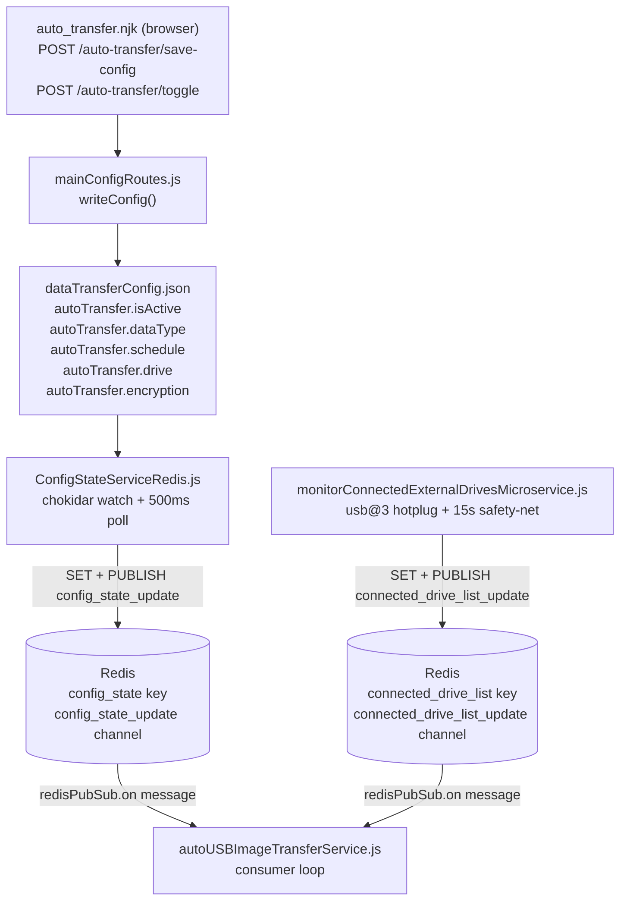
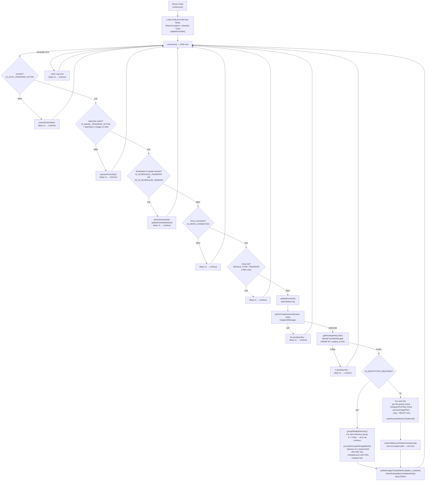
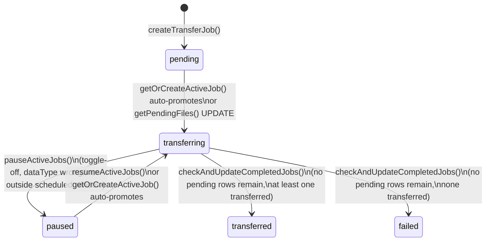
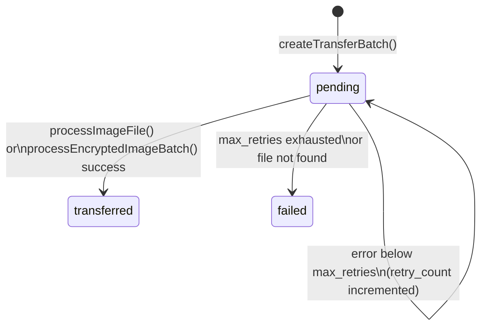

# USB Image Transfer Service — Activity & Behaviour Map

**Service**: `autoUSBImageTransferService.js`  
**PM2 name**: `autoUSBImageTransferService`  
**Log file prefix**: `image-usb-pipeline`  
Last updated: 2026-06-20

_Companion to `FILES_VIDEOS_AUTO_TRANSFER_MAP.md` and the project-level `PROJECT_MAP.md`. Covers the complete USB image transfer pipeline — start/stop control, USB connect/disconnect handling, job resume semantics, Continuous Loop mode, file selection, error handling, and known stall risks. No code changes are described here._

---

## 1. Scope

This document covers **pipeline #1** in `FILES_VIDEOS_AUTO_TRANSFER_MAP.md`:

| Service | Source table | Destination | Queue tables | Done flag |
|---|---|---|---|---|
| `autoUSBImageTransferService.js` | `files` | USB drive (`G:\` etc.) | `transfer_queue_job` / `transfer_queue` | `files.is_auto_transferred` |

FTP image, USB video, and FTP video pipelines are out of scope except where referenced for comparison.

---

## 2. Control-Plane Architecture

How a UI click reaches the consumer loop:



**Propagation latency**: Config file write → `chokidar` fires within milliseconds; additionally `ConfigStateServiceRedis` publishes every 500 ms, so all downstream services see the new config within ≤ 1 s under normal conditions.

---

## 3. Consumer Activity Diagram

The `consumer()` function in `autoUSBImageTransferService.js` runs a `while (true)` loop. Every iteration goes through four sequential gates before touching any file.



---

## 4. Start / Stop Control

### 4.1 Toggle (`isActive`)

The UI sends `POST /auto-transfer/toggle` with `{ isActive: true|false }`. `mainConfigRoutes.js` calls `writeConfig()` which updates `dataTransferConfig.json`. `ConfigStateServiceRedis.js` (chokidar + polling) then publishes the full config on `config_state_update`.

Inside the service, the pub/sub handler compares `IS_AUTO_TRANSFER_ACTIVE` (old) with the new value and fires **edge-triggered** side effects:

```
// autoUSBImageTransferService.js lines 342–359
wasActive = IS_AUTO_TRANSFER_ACTIVE  (before update)
IS_AUTO_TRANSFER_ACTIVE = parsedMessage.autoTransfer.isActive

if (IS_AUTO_TRANSFER_ACTIVE && !wasActive)   → resumeActiveJobs()   // false → true
if (!IS_AUTO_TRANSFER_ACTIVE && wasActive)   → pauseActiveJobs()    // true → false
```

`pauseActiveJobs()` flips all `status='transferring'` rows in `transfer_queue_job` to `paused` (with an `error_message` reason). `resumeActiveJobs()` flips `paused` and `pending` rows back to `transferring`. The consumer loop also calls `pauseActiveJobs()` unconditionally every iteration while inactive (belt-and-suspenders).

### 4.2 Data-type gate

```
IS_IMAGE_TRANSFER_ACTIVE = ['images', 'both'].includes(dataType)
```

If the operator switches `dataType` to `videos`, the image consumer pauses jobs each iteration. **This is independent of the `isActive` toggle** — both must be true for image transfers to run.

### 4.3 Schedule gate

| `schedule.type` | Behaviour |
|---|---|
| `continuous` (default) | `IS_SCHEDULED_TRANSFER = false` → gate skipped, loop runs every cycle |
| `scheduled daily` | Active for **2-hour window** starting at `schedule.hour:00` |
| `scheduled weekly` | Active for **4-hour window** on `schedule.dayOfWeek` at `schedule.hour:00` |

Outside a scheduled window, `pauseActiveJobs()` is called and `updateScheduleStatus()` recomputes `NEXT_SCHEDULED_RUN`.

### 4.4 Drive gate

`IS_DRIVE_CONNECTED = false` → loop sleeps 1 s, continues. Does **not** pause the DB job — see §5.

### 4.5 Space gate

`imageSpaceValidator.isDriveNearFull(99)` is called inside `updateDriveInfo()` and sets `SHOULD_STOP_TRANSFER`. At **≥ 99% used**, the loop sleeps without processing. A warning is logged (but transfer continues) from **≥ 85%** via `getSpaceStatus()` (which shows `"Drive is getting full."`). Example from the user's log trace:

```
Space=Drive is getting full. 78653.4MB free (91.8% used)
```

91.8% is above 85% (warning) but below 99% (stop) — transfer proceeds normally.

---

## 5. USB Connect / Disconnect

### Detection path

`monitorConnectedExternalDrivesMicroservice.js` drives all USB state:

1. **usb@3 hotplug** — native `connect` / `disconnect` events trigger `triggerReconcile()` at +400 ms, +1200 ms, +3000 ms (gives Windows time to assign a drive letter).
2. **15-second safety-net** — `setInterval(() => triggerReconcile('safety-net'), 15000)` catches non-USB removable media and missed events.
3. **Fallback** — if the usb@3 native module fails to load, falls back to a 1-second polling loop.

After each reconcile, `redis.set(CONNECTED_DRIVE_LIST, ...)` + `redis.publish(CONNECTED_DRIVE_LIST_UPDATE, ...)`. The image service receives this via `redisPubSub.on('message')` and calls `updateDriveInfo()`.

### Effect on the image service

`updateDriveInfo()` sets `IS_DRIVE_CONNECTED` and `SHOULD_STOP_TRANSFER`. On disconnect:

```
DRIVE_INFO = null
IS_DRIVE_CONNECTED = false
SHOULD_STOP_TRANSFER = true
```

The consumer loop at gate G4 then sleeps 1 s per iteration. **The active `transfer_queue_job` row is NOT flipped to `paused`** — it stays `transferring`. Pending `transfer_queue` rows stay `pending`. This is intentional for continuous-mode: the job is preserved exactly so the next reconnect resumes automatically without any operator intervention.

On reconnect, `updateDriveInfo()` sets `IS_DRIVE_CONNECTED = true`, the loop passes G4, calls `getOrCreateActiveJob()`, and finds the still-`transferring` job. The non-processed `transfer_queue` rows (still `pending`) are picked up immediately.

> **Contrast with toggle-off**: toggle-off explicitly flips the job to `paused` in the DB (via `pauseActiveJobs()`). A USB disconnect does not touch the job status.

---

## 6. How Resume Works

Resume is **file-level**, mediated entirely by the `transfer_queue` table. Already-transferred files are never re-processed.

### Resume path (from the user's log trace)

```
[USB_IMAGE_REDIS_UPDATE] Auto transfer reactivated - resuming paused jobs
  → imageJobManager.resumeActiveJobs()
  → UPDATE transfer_queue_job SET status='transferring'
       WHERE status IN ('paused','pending') AND batch_origin='auto'

[IMAGE_JOB] Resumed 1 image jobs: f8880191-f4df-4687-96a4-53bd59617032

[IMAGE_JOB] Found active job: f8880191-f4df-4687-96a4-53bd59617032 (status: transferring)
  → getOrCreateActiveJob() finds the non-terminal job

[USB_IMAGE_CONSUMER] Found 9 pending image files
  → getPendingFiles(1000)
  → SELECT … WHERE tq.status='pending' AND tqj.status IN ('transferring','pending')
       ORDER BY tq.created_at ASC LIMIT 1000

[USB_IMAGE_CONSUMER] Batch completed: 9 transferred, 0 failed in 5798.10ms
```

### Resume invariants

| State | What happens on resume |
|---|---|
| Job was `paused` (toggle-off) | `resumeActiveJobs()` flips to `transferring`; next `getOrCreateActiveJob()` finds it |
| Job was still `transferring` (USB disconnect) | `getOrCreateActiveJob()` finds it directly; no flip needed |
| Job was `paused` and found by `getOrCreateActiveJob()` | Auto-promoted: `UPDATE … SET status='transferring'` (lines 50-52 of `ImageJobManager`) |
| All files were `transferred` | `checkAndUpdateCompletedJobs()` closes the job; `getOrCreateActiveJob()` creates a fresh one |

---

## 7. Continuous Loop Mode (Images Only)

The "Continuous Loop" radio button in the UI (`#continuousTransfer`, value `"continuous"`) is saved as:

```json
{
  "autoTransfer": {
    "schedule": { "type": "continuous" },
    "dataType": "images"
  }
}
```

Inside the service:

```js
IS_SCHEDULED_TRANSFER = (SCHEDULE_CONFIG.type === 'scheduled')  // false for "continuous"
IS_IMAGE_TRANSFER_ACTIVE = ['images', 'both'].includes('images') // true
```

Effect: gates G3 (schedule), G2 (data-type) both pass. The loop runs on a ~1 s idle cadence when no work is available, and sleeps 500 ms between batches when processing. Practically, a new batch starts every 1–2 seconds as long as pending files exist.

> This matches the user's log: service resumed → USB connected → 9 files found → batch complete in ~5.8 s → loop continues.

---

## 8. File Selection and Ordering

### Active query (`ImageJobManager.getFilesToTransfer`, lines 139–188)

```sql
SELECT
    ARRAY_AGG(f.id) AS ids,
    ARRAY_AGG(f.tid) AS tids,
    plate_num, site_id, date_folder, time_folder,
    ARRAY_AGG(f.file_path) AS file_paths,
    ARRAY_AGG(f.file_size) AS file_sizes,
    ARRAY_AGG(f.file_name) AS file_names
FROM public.files f
WHERE f.deleted = false
GROUP BY f.plate_num, f.site_id, f.date_folder, f.time_folder
HAVING
    BOOL_AND(f.file_size > 0)                          -- all files in group have size
    AND BOOL_OR(NOT COALESCE(f.is_auto_transferred, false)) -- at least one not yet transferred
    AND COUNT(f.id) = 3                                -- EXACTLY 3 files in the group
ORDER BY
    TO_TIMESTAMP(MIN(f.date)::text || ' ' || MIN(f.time)::text, 'YYYY-MM-DD HH24:MI:SS') DESC
LIMIT 1000;
```

**Key properties:**
- **No date filter** — the full backlog is considered, not just today.
- **Newest groups first** — groups are ordered by the earliest timestamp inside the group, descending. When a new batch starts, it starts from the most recent plate events.
- **Exactly 3 files per group** — `HAVING COUNT = 3`. A plate event with 1, 2, or ≥ 4 files is **never selected**. This matches the encrypted-batch logic which groups by directory and requires ≥ 3 files (dirs with < 3 are actively errored).
- **Limit 1000 groups** = up to 3 000 individual files per job creation call.

### Unused today-only query (`query2`)

A second query is defined in the same method (lines 161–186):

```sql
WITH filtered AS (
    SELECT * FROM public.files
    WHERE deleted = false AND file_size > 0
      AND ts::date = CURRENT_DATE           -- today only
      AND is_auto_transferred = false
)
SELECT … GROUP BY … HAVING … ORDER BY MIN(f.ts) DESC LIMIT $1;
```

**This query is defined but never used** — line 188 runs `query` (full backlog). The `query2` definition is the natural insertion point if a "today only" or selectable start-date filter is ever needed. No UI date picker currently exists.

### Ordering summary (matching `FILES_VIDEOS_AUTO_TRANSFER_MAP.md` §4)

| Pipeline | Order | Date window | Batch unit |
|---|---|---|---|
| USB image | `MIN(date+time) DESC` — **newest first** | None (full backlog) | Plate-group of **exactly 3** |
| FTP image | Same (inherited) | None | Plate-group of exactly 3 |
| USB video | `recording_date ASC` — **oldest first** | Last 7 days | Per-camera, 38 segments |

---

## 9. Error Handling Reference

### Per-file (non-encrypted path)

| Error | Detection | Action |
|---|---|---|
| Source file missing | `ENOENT` on `lstat`/`stat`/`open`/`read` (`TransferUtils.isFileNotFoundError`) | Mark `transfer_queue.status = 'failed'`, `continue` to next file |
| Drive removed during copy | `isDriveRelatedError()` regex matches (`drive disconnected`, `usb removed`, `device not ready`, mkdir `ENOENT`, write to `F-Z:\`, `path not found`) | Set `IS_DRIVE_CONNECTED = false`, `break` batch — remaining files stay `pending` |
| `EBUSY` on copy | `fs.copy` throws `EBUSY` | `copyWithRetry`: retries up to 3 times with 1000 ms delay before re-throwing |
| Insufficient space | `!hasSpaceForFile(file.file_size)` before copy | `handleImageTransferError()` + `break` batch |
| Any other error | Generic catch | `handleImageTransferError()`: increments `retry_count`; at `retry_count ≥ max_retries` (default 3) → `failed`; else stays `pending` for next iteration |

### Per-file guards (checked each iteration inside the loop)

```js
if (!IS_AUTO_TRANSFER_ACTIVE || !IS_DRIVE_CONNECTED || SHOULD_STOP_TRANSFER)
    → log reason, break
```

### Encrypted batch path

| Error | Action |
|---|---|
| `< 3 files` for a directory group | `handleImageTransferError()` for each file in the group, `continue` to next dir |
| AES encrypt / RSA wrap failure | `handleImageTransferError()` for all files in the batch, then: |
| — if `isFileNotFoundError` | `updateTransferStatus(failed)`, `continue` |
| — if `isDriveRelatedError` | `IS_DRIVE_CONNECTED = false`, `break` |
| — else | `handleImageTransferError()` (retry logic) |

### Outer consumer catch

Any uncaught error from the inner `runWithTrace` block is caught at the outer consumer level:
```
logger.error('[USB_IMAGE_CONSUMER] Error in transfer consumer:', …)
sleep(1000) → continue
```
This ensures the process never dies on a transient error.

---

## 10. State Machines

### Job (`transfer_queue_job`)



### Queue row (`transfer_queue`)



> A queue row that is `pending` when the consumer breaks (drive error, space, toggle-off) remains `pending` and is picked up on the next successful iteration. There is no `paused` state at the queue-row level.

---

## 11. Observations and Stall Risks

These are **documentation-only observations** — no code has been changed. They correspond to items **I-4** and related entries in `FILES_VIDEOS_AUTO_TRANSFER_MAP.md §8`.

### O-A — Exactly-3 rule is intentional by design (not a stall risk)

`getFilesToTransfer` uses `HAVING COUNT(f.id) = 3`. This is a **deliberate business invariant** tied directly to the capture side:

In `securos-scripts/OptimizedImageCapture.js`, every LPR camera object (`LPR_CAM`) defines exactly 3 camera IDs (`cam_ids` — e.g., cam 4, cam 3, cam 7 for LPR #1). On every `CAR_LP_RECOGNIZED` event, `carReact()` iterates through all three cameras and calls `processCameraCapture` for each, writing one row to `files` per camera. A correctly captured plate event therefore always produces exactly 3 rows sharing the same `(plate_num, site_id, date_folder, time_folder)` key.

**Fewer than 3 rows** for a group means one or more `IMAGE_EXPORT` operations are still in flight (async delay between the `EXPORT` react and the completion callback writing the file size), or a camera export failed outright. In either case, waiting for the next cycle is the correct behaviour: the group is skipped until all 3 images are confirmed written. Transferring a partial group would produce an incomplete plate record at the destination.

**Exactly 4 or more rows** should not occur in normal operation; if it does, it indicates a duplicate recognition event for the same plate/time.

The encrypted batch path enforces the same invariant from the destination side: directories with < 3 files are actively errored to prevent creating orphaned encrypted batches without a complete metadata manifest.

**Operational check**: if `files.is_auto_transferred = false` rows for a group persist for more than a few seconds past the capture timestamp, the underlying cause is a camera export failure, not the transfer service:

```sql
SELECT plate_num, date_folder, time_folder, COUNT(*) AS file_count
FROM files
WHERE deleted = false AND is_auto_transferred = false
GROUP BY plate_num, date_folder, time_folder
HAVING COUNT(*) != 3;
```

### ~~O-B — `markUSBSourceFilesAsTransferred` uses queue `id`, not `file_id` (non-encrypted path)~~ **RESOLVED**

**Fixed in `autoUSBImageTransferService.js`** (2026-06-21). The non-encrypted path now:

1. Accumulates `file.file_id` values in a `successfulFileIds` array only for files where `processImageFile` completes without throwing.
2. Calls `await TransferUtils.markUSBSourceFilesAsTransferred(pool, successfulFileIds, "auto")` guarded by `successfulFileIds.length > 0` — so early-`break` batches and fully-failed batches never trigger the DB update.

This mirrors the encrypted path (`processEncryptedImageBatch` → `markSourceFilesAsTransferred(pool, [file.file_id], 'auto')` per file on success).

Previous defects (for reference):
- `f.id` (`transfer_queue.id`) was passed instead of `f.file_id` (`files.id`), causing potential mis-marking of random files.
- The call ran over all `filesToProcess` even after an early `break`, marking uncopied files as transferred.
- The call was unawaited, silently discarding DB errors.

### ~~O-C — Disconnect not reflected in job status~~ **RESOLVED**

**Fixed in `autoUSBImageTransferService.js`** (2026-06-21). The `!IS_DRIVE_CONNECTED` gate now calls `await imageJobManager.pauseActiveJobs('USB drive disconnected')` before sleeping, mirroring the existing `!IS_AUTO_TRANSFER_ACTIVE` and `!IS_IMAGE_TRANSFER_ACTIVE` gates.

- **Disconnect → pause**: any iteration where `IS_DRIVE_CONNECTED` is false (whether set by the Redis hotplug handler via `updateDriveInfo`, or by a mid-batch drive error `break`) calls `pauseActiveJobs`, setting `status='paused'`. The call is idempotent — if the job is already paused, the UPDATE matches 0 rows.
- **Reconnect → resume**: unchanged. `getOrCreateActiveJob` already auto-resumes `paused` jobs when the loop clears the gate with `IS_DRIVE_CONNECTED = true`.

Previous description (for reference): a USB disconnect idled the loop but left the job `status='transferring'`, so monitoring queries would see a "live" job even with no transfer happening.

### ~~O-D — Split source-marking (`files` vs `iss_media_files`)~~ **RESOLVED**

**Fixed in `services/image-transfer/transfer/ImageTransferManager.js`** (2026-06-21). Both `processImageFile` (line 141) and `processEncryptedImageBatch` (line 324) now call `TransferUtils.markImageFilesAsTransferred` instead of `TransferUtils.markSourceFilesAsTransferred`.

- `markImageFilesAsTransferred` → `UPDATE files SET is_auto_transferred = true WHERE id = ANY($1)` — the table and column that `getFilesToTransfer` checks. ✓
- `markSourceFilesAsTransferred` → `UPDATE iss_media_files ...` — the video pipeline table; no longer called from the image USB pipeline.

**Impact by path after fix:**
- **Non-encrypted**: `processImageFile` → `markImageFilesAsTransferred(files)` per file; batch-level `markUSBSourceFilesAsTransferred(files)` (O-B safety net) remains and is idempotent.
- **Encrypted**: `processEncryptedImageBatch` → `markImageFilesAsTransferred(files)` per file inside the batch loop. `files.is_auto_transferred` is now set after each file succeeds — previously it was NEVER set for encrypted files, causing infinite re-queuing.

Previous description (for reference): `processImageFile` called `markSourceFilesAsTransferred` (writing to `iss_media_files`), while `getFilesToTransfer` checked `files.is_auto_transferred`. For the encrypted path there was no call to `files` at all, so encrypted files were re-selected by every subsequent job.

### O-E — `query2` (today-only) is defined but unreachable

A date-limited query exists in `ImageJobManager.getFilesToTransfer` (lines 161–186) that would restrict selection to `ts::date = CURRENT_DATE`. It is **never called** — line 188 always runs `query` (full backlog). If a "start from today" or "date range" feature is needed, this is the correct place to add a switch.

---

## 12. Key Constants and Configuration

| Item | Value / Source |
|---|---|
| Consumer idle sleep | 1 000 ms |
| Post-batch sleep | 500 ms |
| Space stop threshold | 99% used (`isDriveNearFull(99)`) |
| Space warning threshold | 85% used (`isDriveNearFull()` default) |
| Image buffer floor | 10 MB (`bufferMB`) |
| Min required space | 50 MB (`minRequiredSpaceMB`) |
| Files per group (selection) | Exactly 3 (`COUNT = 3`) |
| Encrypted batch size | 3 files per AES key |
| EBUSY retries | 3 × 1 000 ms |
| General max retries | 3 (per `transfer_queue` row) |
| Pending files per iteration | 1 000 (`getPendingFiles(1000)`) |
| Max groups per job creation | 1 000 (`getFilesToTransfer(1000)`) |
| Drive safety-net interval | 15 000 ms |
| Drive hotplug reconcile delays | 400 ms, 1 200 ms, 3 000 ms |
| Config propagation latency | ≤ 1 s (chokidar + 500 ms poll) |
| Schedule daily window | 2 hours from `schedule.hour:00` |
| Schedule weekly window | 4 hours from `schedule.hour:00` |

---

## 13. Verification Pointers

| Symptom | Where to check |
|---|---|
| Image files never transferred | `files` table — find groups where `COUNT(*) != 3` (O-A) |
| Files re-queued into new jobs | O-D fixed (2026-06-21): both transfer paths now call `markImageFilesAsTransferred` → `files.is_auto_transferred` |
| Transfer appears stuck but job shows `transferring` | O-C fixed (2026-06-21): disconnect now sets job to `paused` via `pauseActiveJobs` in the `!IS_DRIVE_CONNECTED` gate |
| USB reconnect doesn't resume | Confirm `ConfigStateServiceRedis` is running and publishing; check `config_state_update` Redis channel |
| `Encryption enabled - processing N files in batches of 3` | `IS_ENCRYPTION_REQUIRED=true`; requires `certs/public_key.pem` to exist |
| `Not enough files for directory` warning | Encrypted path: a directory group has < 3 files — those files are errored, not transferred |
| Wrong files marked transferred | O-B fixed (2026-06-21): `successfulFileIds` now tracks only files where `processImageFile` succeeded |

---

_Sources: `autoUSBImageTransferService.js`, `services/image-transfer/state/ImageJobManager.js`, `services/image-transfer/transfer/ImageTransferManager.js`, `services/image-transfer/validators/ImageSpaceValidator.js`, `services/shared/TransferUtils.js`, `monitorConnectedExternalDrivesMicroservice.js`, `ConfigStateServiceRedis.js`, `redisKeyStore.js`, `routes/mainConfigRoutes.js`, `data_transfer_v2/views/auto_transfer.njk`, `securos-scripts/OptimizedImageCapture.js`. Last updated: 2026-06-21 (O-D fixed — processImageFile and processEncryptedImageBatch now call markImageFilesAsTransferred to write files.is_auto_transferred, preventing infinite re-queuing of encrypted files)._
