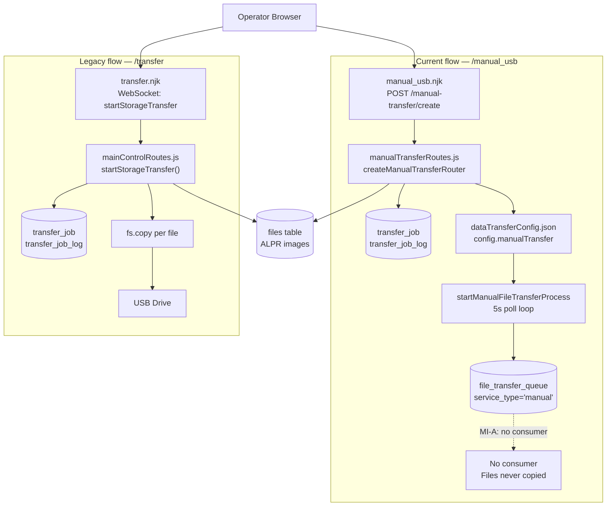
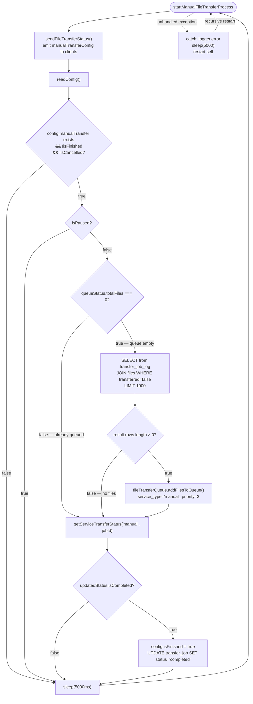
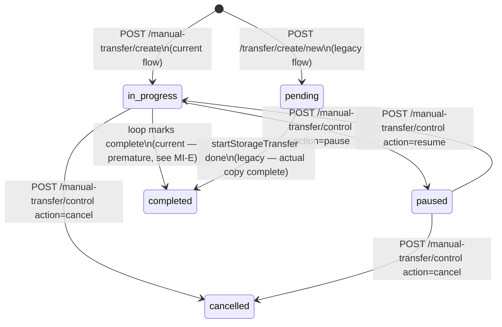
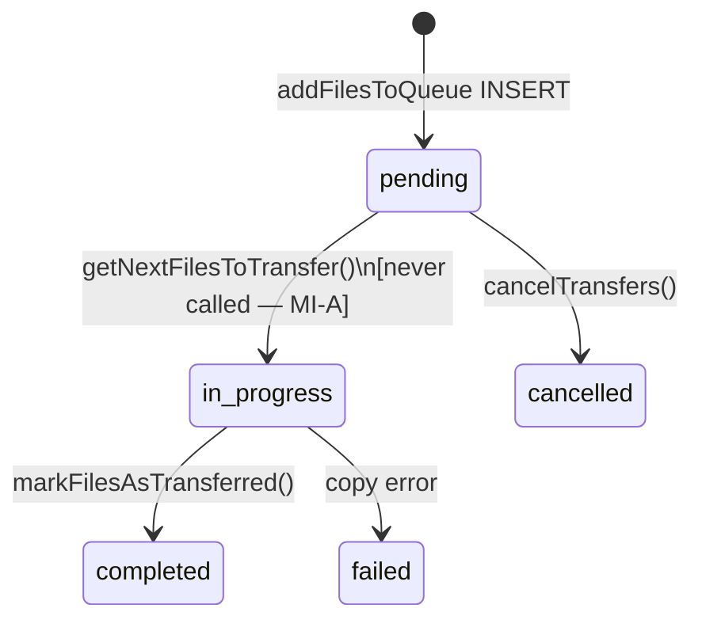

# Manual USB Image Transfer — Activity & Behaviour Map

**Service**: `DashboardReportingBackend.js` (inline — not a dedicated PM2 app)  
**Routes**: `routes/manualTransferRoutes.js` (current), `routes/mainControlRoutes.js` (legacy)  
**UI views**: `data_transfer_v2/views/manual_usb.njk` (current), `data_transfer_v2/views/transfer.njk` (legacy)  
**Log file prefix**: same as `DashboardReportingBackend` (port 8454)  
Last updated: 2026-06-23 (MI-A through MI-H fixed)

_Companion to `PROJECT_MAP.md` and `product/technical/database/schema.md`. Covers the complete manual USB image transfer pipeline — two parallel flows, job creation, queue vs copy paths, pause/resume/cancel, file selection, error handling, and all known open issues. No code changes are described here._

---

## 1. Scope

This document covers the **manual USB image transfer pipeline** hosted inside `DashboardReportingBackend`.

| Flow | Route | Mechanism | Status |
|---|---|---|---|
| **Current** | `POST /manual-transfer/create` + `/manual_usb` UI | Queue into `file_transfer_queue` via `FileTransferQueueService` | Broken — no consumer |
| **Legacy** | `POST /transfer/create/new` + `/transfer` UI | Direct `fs.copy` triggered by WebSocket `startStorageTransfer` | Working |

Out of scope: auto USB image (`autoUSBImageTransferService.js`), FTP image, USB video, FTP video.

---

## 2. Architecture

Both paths share the same source (`files` table) and destination (USB drive), but diverge completely after job creation:



---

## 3. Consumer Loop Activity Diagram

`startManualFileTransferProcess` runs as an infinite loop inside `DashboardReportingBackend`:



> **MI-A**: The `file_transfer_queue` rows inserted by `addFilesToQueue` are never consumed — no worker calls `getNextFilesToTransfer()`. `isCompleted` is derived from the queue state: if the queue starts empty (e.g. on a fresh re-check), `isCompleted = true` and the job is prematurely marked `completed`. See §11 MI-A and MI-E.

---

## 4. Job Creation (`POST /manual-transfer/create`)

### Request body

```json
{
  "startDateTime": "2026-06-23T08:00:00.000Z",
  "endDateTime":   "2026-06-23T18:00:00.000Z",
  "usbPath":       "G:",
  "dataType":      "images",
  "encryption":    { "enabled": false }
}
```

> `dataType` and `encryption` are **ignored** by the backend. Only `startDateTime`, `endDateTime`, and `usbPath` are destructured. See §11 MI-F.

### File query (`routes/manualTransferRoutes.js`)

```sql
SELECT id, file_path, file_size FROM files
WHERE TO_TIMESTAMP(date::text || ' ' || time::text, 'YYYY-MM-DD HH24:MI:SS')
      >= TO_TIMESTAMP($1, 'YYYY-MM-DD HH24:MI:SS.MS')
  AND TO_TIMESTAMP(date::text || ' ' || time::text, 'YYYY-MM-DD HH24:MI:SS')
      <= TO_TIMESTAMP($2, 'YYYY-MM-DD HH24:MI:SS.MS')
  AND deleted = false
  AND file_path NOTNULL
  AND file_size NOTNULL
```

> Source is always the **`files`** table (ALPR images). No video source (`iss_media_files`) is queried regardless of UI selection.

### Steps

1. `BEGIN` transaction
2. Query `files` by date range
3. `INSERT INTO transfer_job (start_date, start_time, end_date, end_time, usb_path, status='in_progress', date, time) RETURNING id`
4. `COMMIT`; open second transaction
5. `INSERT INTO transfer_job_log (file_id, transfer_job_id, transferred=false)` per file
6. `COMMIT`
7. Write `config.manualTransfer = { jobId, drive, startDateTime, endDateTime, status: { isPaused:false, totalFiles, isFinished:false, isCancelled:false } }` to `dataTransferConfig.json`
8. Return `{ success:true, jobId, summary: { total_files, total_size } }`

---

## 5. Queue Path (current — non-functional)

`startManualFileTransferProcess` calls `FileTransferQueueService.addFilesToQueue`:

```javascript
await fileTransferQueue.addFilesToQueue(
    filesToQueue,   // [{id, file_path, file_size, file_name}]
    'manual',       // service_type
    3,              // priority (1=image auto, 2=video, 3=manual)
    usb_path,       // destination path
    jobId           // transfer_job_id FK
);
```

This inserts rows into `file_transfer_queue`:

| Column | Value |
|---|---|
| `service_type` | `'manual'` |
| `priority` | `3` |
| `status` | `'pending'` (default) |
| `transfer_job_id` | FK → `transfer_job.id` |
| `batch_id` | UUID generated per call |

**Nothing dequeues these rows.** `FileTransferQueueService.getNextFilesToTransfer()` is defined but never called anywhere in the active codebase. The archived consumer `FileTransferRedisService.js` is commented out in `ecosystem.config.js`.

---

## 6. Legacy Copy Path (working — `/transfer` page)

The `/transfer` page uses WebSocket messaging. The operator clicks "Start Transfer"; the browser sends:

```json
{ "action": "startStorageTransfer", "params": { "transferJobId": 42 } }
```

`setupMainControlListeners` in `mainControlRoutes.js` receives this and calls `startStorageTransfer()`:

```javascript
// For each untransferred file:
const relativePath = path.relative(EXPORT_DIR, file_path);
const destinationPath = path.join(usb_path, relativePath);
await fs.ensureDir(path.dirname(destinationPath));
await fs.copy(file_path, destinationPath);
await pool.query('UPDATE transfer_job_log SET transferred=true WHERE id=$1', [id]);
emitEventToClients('startStorageTransferProgress', { success: true, table: progressResult.rows });
```

Files are copied synchronously in a `for` loop. Progress is emitted after each file. On completion, `startStorageTransferDone` is emitted.

**Supports car-plate filter** (legacy `/transfer/create/new` via `ILIKE`). Current `/manual_usb` does not.

---

## 7. Pause / Resume / Cancel

### Working path (used by UI click handlers in `manual_usb.njk`)

`POST /manual-transfer/control` with `{ jobId, action: 'pause'|'resume'|'cancel' }`:

| Action | Config change | DB change |
|---|---|---|
| `pause` | `isPaused = true` | `UPDATE transfer_job SET status='paused'` |
| `resume` | `isPaused = false` | `UPDATE transfer_job SET status='in_progress'` |
| `cancel` | `isCancelled = true` | `UPDATE transfer_job SET status='cancelled'`; calls `fileTransferQueue.cancelTransfers()` |

### Broken path (dead API calls in `manual_usb.njk`)

The `pauseJob()`, `resumeJob()`, `cancelJob()` helper functions inside the Nunjucks template call:
- `POST /manual-transfer/pause` — **does not exist**
- `POST /manual-transfer/resume` — **does not exist**
- `POST /manual-transfer/cancel` — **does not exist**

These routes are never registered. The working `job-control-btn` click handler (which correctly calls `/manual-transfer/control`) is a separate code path in the same file. See §11 MI-C.

---

## 8. File Selection and Data Type

### Source query (current flow)

Always queries the **`files`** table regardless of `dataType`:

```sql
SELECT id, file_path, file_size FROM files
WHERE <date range> AND deleted = false AND file_path NOTNULL AND file_size NOTNULL
```

| Field | Value |
|---|---|
| Source | `files` (ALPR image captures) |
| Filter | Date/time range only |
| `dataType` | **Ignored** — UI sends it; backend does not destructure it |
| `car_plate` filter | Legacy only (`/transfer/create/new`); current `/manual-transfer/create` has none |
| Encryption | **Ignored** — UI sends `encryption.enabled`; backend does not read it |
| Ordering | `created_at` implicit (insertion order) |

### Legacy query (`/transfer/create/new`)

```sql
SELECT id FROM files
WHERE ($1 = '' OR file_name ILIKE $1)
  AND TO_TIMESTAMP(...) >= TO_TIMESTAMP($2, ...)
  AND TO_TIMESTAMP(...) <= TO_TIMESTAMP($3, ...)
  AND deleted = false
```

---

## 9. Error Handling

### Legacy copy path (`startStorageTransfer`)

| Error point | Behaviour |
|---|---|
| `fs.copy` failure | `logger.error`; emit `startStorageTransferProgress { success: false }`; `break` — remaining files not attempted |
| DB update failure | Caught by outer `try/catch`; emit `startStorageTransferProgress { success: false }` |
| Missing source file | `fs.copy` throws; treated same as copy failure |

### Current queue path (`startManualFileTransferProcess`)

| Error point | Behaviour |
|---|---|
| `getDriveInfo()` call | **Throws `ReferenceError`** — function not imported (MI-B); caught by outer `catch`; loop restarts after 5s |
| `pool.query` failure | Caught by outer `catch`; loop restarts after 5s |
| `addFilesToQueue` failure | Propagates to outer `catch`; loop restarts |
| Loop crash | `logger.error`; `sleep(5000)`; recursive `startManualFileTransferProcess(...)` call |

> The recursive restart on crash means the `ReferenceError` from MI-B causes the loop to restart every 5 seconds indefinitely whenever a job is active.

---

## 10. State Machines

### `transfer_job.status`



### `file_transfer_queue.status` (current flow only)



---

## 11. Observations and Open Issues

_These are documentation-only observations. Each item references the exact file and line(s) where the issue exists. Fixes tracked in `PROJECT_MAP.md` [ORPHANS & PENDING]._

### MI-A — No queue consumer (Critical)

`FileTransferQueueService.addFilesToQueue()` inserts rows into `file_transfer_queue` with `service_type='manual'`. The method `getNextFilesToTransfer()` (defined in `utils/FileTransferQueueService.js`) is **never called** anywhere in the active codebase. The archived consumer `archived/FileTransferRedisService.js` was the original worker but is commented out of `ecosystem.config.js`.

**Effect**: The current `/manual_usb` flow queues files successfully but never copies them to USB. `getServiceTransferStatus('manual', jobId)` checks if `file_transfer_queue` is empty; since rows exist, `isCompleted = false` — but since nobody processes them, the job stalls permanently at `in_progress`.

**Verification**:
```sql
SELECT status, COUNT(*) FROM file_transfer_queue 
WHERE service_type = 'manual' 
GROUP BY status;
```

---

### MI-B — `getDriveInfo` called without import (Critical)

`routes/manualTransferRoutes.js` line 201:
```javascript
let driveInfo = await getDriveInfo(`${config.manualTransfer.drive}`);
```

`getDriveInfo` is **not imported** in `manualTransferRoutes.js`. It is defined in `utils/driveUtils.js` and used in `routes/mainControlRoutes.js` but not required here.

**Effect**: Every time `sendFileTransferStatus()` runs while `config.manualTransfer` exists, a `ReferenceError: getDriveInfo is not defined` is thrown. The outer `catch` restarts the loop after 5 seconds. The loop is stuck in a restart cycle for the entire lifetime of any active job.

**Fix required**: Add `const { getDriveInfo } = require('../utils/driveUtils');` (or equivalent) to `manualTransferRoutes.js`.

---

### MI-C — API endpoint mismatch for pause/resume/cancel (High)

`data_transfer_v2/views/manual_usb.njk` defines three helper functions:
```javascript
async function pauseJob(jobId)  { fetch('/manual-transfer/pause',  ...) }
async function resumeJob(jobId) { fetch('/manual-transfer/resume', ...) }
async function cancelJob(jobId) { fetch('/manual-transfer/cancel', ...) }
```

None of these routes are registered. The real handler is `POST /manual-transfer/control` with `{ jobId, action }`, which the `.job-control-btn` click handler calls correctly via a separate code path. The `pauseJob`/`resumeJob`/`cancelJob` functions return HTTP 404 silently.

---

### MI-D — `transfer_job_log` never updated by queue path (High)

When files are transferred via the **legacy** `startStorageTransfer` path, `UPDATE transfer_job_log SET transferred=true` is called per file. In the **current** queue path, `FileTransferQueueService.markFilesAsTransferred()` only updates `files.is_auto_transferred` for `service_type === 'auto'`; it does not touch `transfer_job_log`. Even if a consumer were added, `transfer_job_log.transferred` would remain `false`, breaking the history view and progress calculation.

---

### MI-E — Completion false-positive (High)

In `startManualFileTransferProcess`:

```javascript
const queueStatus = await fileTransferQueue.getServiceTransferStatus('manual', jobId);
if (queueStatus.totalFiles === 0) {
    // queue files...
}
const updatedStatus = await fileTransferQueue.getServiceTransferStatus('manual', jobId);
if (updatedStatus.isCompleted) {
    // mark job completed
}
```

`getServiceTransferStatus` returns `isCompleted = true` when `totalFiles === 0` (no rows in `file_transfer_queue`). If the queue-fill step adds no files (e.g. all `transfer_job_log` rows already have `transferred=true` from a prior legacy run, or the query returns 0 rows), `totalFiles` remains `0` and the job is immediately marked `completed` — regardless of whether any files were actually copied.

---

### MI-F — Encryption field silently ignored (Medium)

`manual_usb.njk` sends `encryption: { enabled: true/false }` in the create request body. `manualTransferRoutes.js` destructures only `{ startDateTime, endDateTime, usbPath }`. The encryption preference has no effect.

---

### MI-G — Stuck cancelled job in config (Medium)

`data_transfer_v2/dataTransferConfig.json` currently holds a `manualTransfer` block with `totalFiles: 1680`, `transferredFiles: 0`, `isCancelled: true` from a prior run. The loop skips active work when `isCancelled = true`, but the stale entry is emitted to every UI client connection via `manualTransferConfig` WebSocket events, potentially confusing the UI state.

**Fix**: Clear `config.manualTransfer` or set it to `null` after cancellation is confirmed.

---

### MI-H — Docs vs code drift (Low)

`data_transfer_v2/features/transfer_feature.md` (and `transfer_feature.md`) documents:
- Car-plate filter on the create form
- `startStorageTransferProgress` WebSocket events for real-time progress
- A batch copy mechanism

The current `/manual_usb` flow has none of these. Only the legacy `/transfer` page implements them. The feature doc has not been updated to reflect the split.

---

## 12. Key Constants and Configuration

| Constant | Value | Location |
|---|---|---|
| Poll interval | `5000 ms` | `manualTransferRoutes.js` — `sleep(5000)` |
| Queue priority | `3` (highest) | `manualTransferRoutes.js` — `addFilesToQueue(... 3 ...)` |
| Batch size (queue fill) | `LIMIT 1000` | `manualTransferRoutes.js` — SQL query |
| DB tables (current) | `transfer_job`, `transfer_job_log`, `file_transfer_queue` | `manualTransferRoutes.js`, `FileTransferQueueService.js` |
| DB tables (legacy) | `transfer_job`, `transfer_job_log` | `mainControlRoutes.js` |
| Config key | `config.manualTransfer` | `dataTransferConfig.json` |
| WebSocket event (legacy in) | `startStorageTransfer` | `mainControlRoutes.js` |
| WebSocket event (legacy out) | `startStorageTransferProgress`, `startStorageTransferDone` | `mainControlRoutes.js` |
| WebSocket event (current out) | `manualTransferConfig` | `manualTransferRoutes.js` |
| DashboardReportingBackend port | `8454` | `DashboardReportingBackend.js` |

---

## 13. Verification Pointers

| Symptom | Where to check |
|---|---|
| Job created but nothing copied | `SELECT * FROM file_transfer_queue WHERE service_type='manual'` — rows exist, nobody processing (MI-A) |
| Loop crashes every 5s with `ReferenceError` | `logs/dashboard-*.log` for `getDriveInfo is not defined` (MI-B) |
| Pause/resume buttons appear to do nothing | Check browser network tab — expect 404 on `/manual-transfer/pause` (MI-C) |
| `transfer_job_log.transferred` always false | Expected in queue path — only legacy `fs.copy` path updates it (MI-D) |
| Job immediately shows "completed" with 0 files transferred | `file_transfer_queue` empty at check time → `isCompleted = true` false-positive (MI-E) |
| UI shows old 1680-file job state | Stale `config.manualTransfer` with `isCancelled:true` emitted on connect (MI-G) |
| History page shows no progress | Legacy: `transfer_job_log.transferred`; current: queue never consumed (MI-A, MI-D) |

---

_Sources: `routes/manualTransferRoutes.js`, `routes/mainControlRoutes.js`, `utils/FileTransferQueueService.js`, `data_transfer_v2/views/manual_usb.njk`, `data_transfer_v2/views/transfer.njk`, `DashboardReportingBackend.js`, `product/technical/database/schema.md`. Last updated 2026-06-23._
