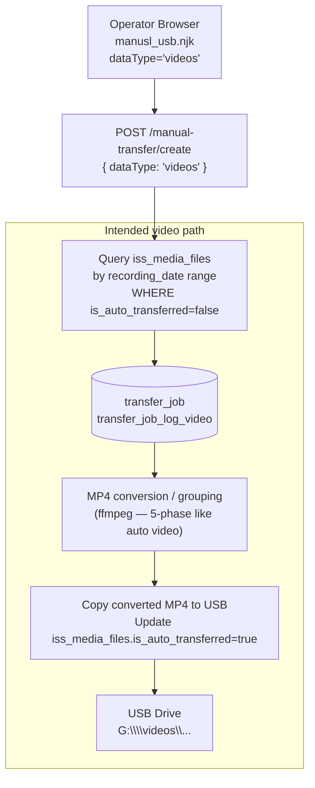
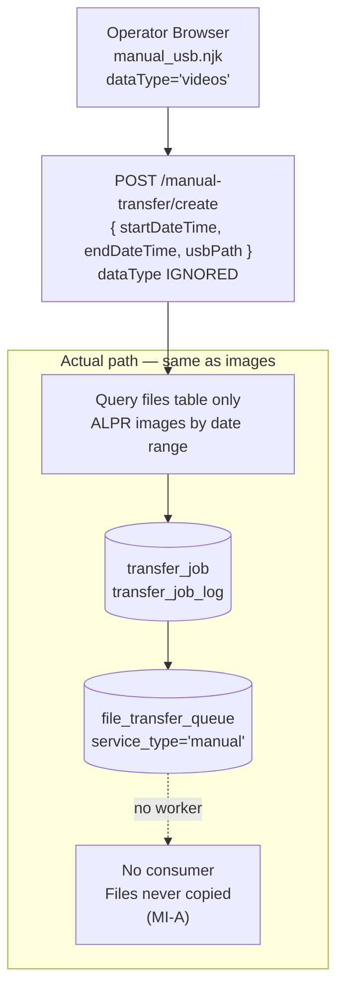

# Manual USB Video Transfer — Gap Analysis & Behaviour Map

**Implementation status**: `NOT IMPLEMENTED`  
**UI entry point**: `data_transfer_v2/views/manual_usb.njk` — "Videos Only" / "Both Images & Videos" radio buttons  
**Actual backend**: `routes/manualTransferRoutes.js` — ignores `dataType`; queries `files` (ALPR images) only  
**Companion auto-video doc**: `product/technical/diagrams/refactored_autoVideoTransferEDAMicroservice-activity.md`  
Last updated: 2026-06-23

_This document maps what the operator UI promises for manual video transfer against what the backend actually delivers. It is a gap-analysis record — not a working-system description. Until MV-A through MV-C are implemented, manual video transfer does not exist. No code changes are described here._

---

## 1. Scope

### What the operator expects

The `/manual_usb` UI (`manual_usb.njk`) presents three data-type options:

| Radio value | Label | Operator expectation |
|---|---|---|
| `images` | Images Only | Transfer ALPR image captures (.jpg/.jpeg) for the selected date range |
| `videos` | **Videos Only** | Transfer ISS video recordings (.mp4 / .issvd) for the selected date range |
| `both` | **Both Images & Videos** | Transfer both types together |

The selected value is sent as `dataType` in the `POST /manual-transfer/create` request body.

### What the backend actually delivers

`manualTransferRoutes.js` **ignores `dataType`** entirely. Regardless of selection:

1. Only the `files` table (ALPR image captures) is queried.
2. No `iss_media_files` table (ISS video source) is queried.
3. No MP4 conversion or grouping step is performed.
4. The same `transfer_job_log` rows are created as for the images-only path.

**Selecting "Videos Only" or "Both Images & Videos" has no effect on what is transferred.** ALPR images are always transferred.

### Out of scope

- Auto USB video transfer (`refactored_autoVideoTransferEDAMicroservice.js`) — separate, working pipeline.
- FTP video transfer (`autoFtpVideoTransferService.js`) — separate pipeline.
- Manual image transfer issues — documented in `manualUSBImageTransferService-activity.md`.

---

## 2. Architecture — Intended vs Actual

### Intended (not built)



### Actual (what exists)



---

## 3. UI Data Flow — How `dataType` Is Lost

The operator selects "Videos Only" and submits. The frontend sends:

```json
POST /manual-transfer/create
{
  "startDateTime": "2026-06-23T08:00:00.000Z",
  "endDateTime":   "2026-06-23T18:00:00.000Z",
  "usbPath":       "G:",
  "dataType":      "videos",
  "encryption":    { "enabled": false }
}
```

The route handler:

```javascript
// routes/manualTransferRoutes.js line 16
router.post('/manual-transfer/create', async (req, res) => {
    const { startDateTime, endDateTime, usbPath } = req.body;
    // dataType and encryption are NOT destructured — silently discarded
    // ...
    const filesResult = await pool.query(`
        SELECT id, file_path, file_size FROM files   -- always files, never iss_media_files
        WHERE TO_TIMESTAMP(...) >= ... AND ...
    `, [startTS, endTS]);
```

`dataType` is not read at any point in `manualTransferRoutes.js`, `startManualFileTransferProcess`, or `FileTransferQueueService`.

---

## 4. What Is Missing

To implement manual video transfer, the following components need to be built:

| Missing component | Description | Auto-video equivalent |
|---|---|---|
| `iss_media_files` query | Date-range query against `iss_media_files` (not `files`) to find video source files | `JobManager.requestAdditionalFilesForCamera` |
| `dataType` routing | Branch in create route: if `dataType === 'images'` → `files`; if `videos` → `iss_media_files`; if `both` → both | None (auto handles one type) |
| Conversion pipeline | ISS `.issvd` files must be converted to MP4 via ffmpeg before transfer | `BufferManager.convertSingleFile` (5-phase) |
| Dedicated queue table | `video_transfer_queue` or extended `file_transfer_queue` with video metadata | `video_transfer_queue`, `video_converted_buffer` |
| `iss_media_files.is_auto_transferred` update | Mark source ISS files as transferred after copy | `processingStateManager.markFilesAsProcessing` |
| Space validation | Estimate converted MP4 size before queuing | `SpaceValidator.validateProcessingSpace` |
| Transfer job log (video) | `transfer_job_log` rows for video files, or a separate `transfer_job_log_video` table | `video_transfer_queue` rows |
| Queue consumer (video) | Worker that dequeues and copies converted MP4s to USB | `_startTransferToStorageAsync` |

---

## 5. Contrast with Auto USB Video

| Dimension | Auto USB Video | Manual USB Video (gap) |
|---|---|---|
| Entry point | PM2 app `autoVideoTransferEDAMicroservice` | Route in `DashboardReportingBackend` — **not built** |
| Source table | `iss_media_files` | **Missing** — current code uses `files` |
| Date filter | 7-day rolling window | Would use operator-selected date range |
| Conversion | 5-phase pipeline (pending → converted → grouped → concat → transferred) | **Missing** — no conversion step |
| Queue table | `video_transfer_queue`, `video_converted_buffer` | **Missing** — would need dedicated table or extended `file_transfer_queue` |
| Transfer | `_startTransferToStorageAsync` (`fs-extra copy`) | **Missing** — no copy worker |
| Done flag | `iss_media_files.is_auto_transferred = true` | **Missing** |
| Camera batching | 38 files per camera per job | Not applicable (operator selects time range) |
| Pause/resume | Drive disconnect → pause; reconnect → resume | **Missing** |
| Progress UI | Real-time WebSocket `camera_progress` events | `manualTransferConfig` event (no video detail) |

---

## 6. Risk if Used Today

| Operator action | Actual outcome | Risk |
|---|---|---|
| Selects "Videos Only", starts transfer | ALPR image files from `files` table are queued (or zero files if time range has no images). No ISS videos are selected or transferred. | **Silent data mismatch** — operator believes videos were transferred; they were not |
| Selects "Both Images & Videos" | Only ALPR images are queued. ISS videos are not included. | **Incomplete transfer** — operator believes both types were handled |
| Checks transfer history | `transfer_job` history shows file counts from `files` (images), not `iss_media_files` (videos) | **Misleading history** |
| No error raised | No warning, no log entry, no UI feedback indicates the video path is unimplemented | **Silent failure — hardest category to detect** |

---

## 7. Observations and Open Issues

_These are documentation-only observations. Fixes tracked in `PROJECT_MAP.md` [ORPHANS & PENDING]._

### MV-A — `dataType` silently ignored (Critical)

`routes/manualTransferRoutes.js:16` — `dataType` is present in `req.body` but not destructured or used at any point in the create, summary, or loop code paths.

**Effect**: Every UI selection other than the implicit "images" behaviour is a no-op. The operator receives a success response with a file count that refers to ALPR images, not the type they selected.

**Verification**:
```javascript
// Check what manualTransferRoutes.js destructures:
const { startDateTime, endDateTime, usbPath } = req.body;
// dataType is missing from this line
```

---

### MV-B — No `iss_media_files` query path (Critical)

No code path exists in `manualTransferRoutes.js`, `mainControlRoutes.js`, `FileTransferQueueService.js`, or any route within `DashboardReportingBackend.js` that queries `iss_media_files`.

**Effect**: Manual video source files cannot be reached. Even adding a `dataType` branch to the create route would require a complete new query against `iss_media_files` with appropriate date-range, `deleted=false`, `is_auto_transferred=false` filters — none of which exist in the manual transfer code.

**Verification**:
```sql
-- Confirm iss_media_files is not referenced in any manual route:
-- Search routes/manualTransferRoutes.js for 'iss_media_files' → 0 results
-- Search routes/mainControlRoutes.js for 'iss_media_files' → 0 results
```

---

### MV-C — No conversion pipeline for ISS video files (Critical)

ISS `.issvd` files must be converted to MP4 via ffmpeg before they can be transferred. The auto video pipeline implements this as a 5-phase process in `BufferManager` (`convertSingleFile`, `groupFilesByCamera`, `concatGroupedFiles`). No equivalent exists in the manual transfer stack.

**Effect**: Even if `iss_media_files` were queried and rows inserted into a transfer queue, the resulting files on USB would be unconverted `.issvd` files (proprietary format) — unusable by standard video players.

---

### MV-D — UI radio buttons imply unimplemented functionality (High)

`data_transfer_v2/views/manual_usb.njk` presents "Videos Only" and "Both Images & Videos" as peer options to "Images Only". All three look identical and functional. There is no disabled state, tooltip, or warning indicating that the video options are not implemented.

**Effect**: Operators may complete a manual transfer believing videos were included, leading to incorrect reporting or missed data on the receiving end.

**Recommended mitigation** (until MV-A–MV-C are fixed): Disable the "Videos Only" and "Both" radio buttons with a visible "Not yet available" label, or add a UI warning when either is selected.

---

## 8. Implementation Path (Reference)

If manual video transfer is to be built, the recommended sequence (based on the auto-video architecture):

1. **Add `dataType` routing to create route** — branch on `'images'` / `'videos'` / `'both'`; for video, query `iss_media_files` with the selected date range.
2. **Extend or replace `file_transfer_queue`** — add video-specific columns (e.g. `needs_conversion`, `converted_path`) or use the existing `video_transfer_queue` + `video_converted_buffer` schema.
3. **Add conversion step** — reuse `BufferManager.convertSingleFile` or wrap ffmpeg directly; store converted files in a temp directory.
4. **Add queue consumer** — a worker (either in `startManualFileTransferProcess` or a dedicated loop) that dequeues converted files and calls `fs.copy` to USB.
5. **Add `iss_media_files.is_auto_transferred` update** — mark source files after successful copy.
6. **Update `transfer_job_log`** — include video rows so history view is accurate.
7. **Disable or update UI** — reflect actual capabilities until fully implemented.

---

## 9. Verification Pointers

| Question | How to verify |
|---|---|
| Is `dataType` read anywhere? | `grep -r 'dataType' routes/manualTransferRoutes.js` → 0 matches in route logic |
| Does any manual route touch `iss_media_files`? | `grep -r 'iss_media_files' routes/` → 0 matches |
| What files are selected for a "Videos Only" job? | `SELECT * FROM transfer_job_log WHERE transfer_job_id = <id>` → all `file_id` values point to `files` rows (ALPR images), never `iss_media_files` |
| What happens to video selections in summary? | `POST /manual-transfer/summary` with `dataType='videos'` returns same count as `images` — both query `files` only |
| Does `file_transfer_queue` contain video entries from manual? | `SELECT service_type, COUNT(*) FROM file_transfer_queue GROUP BY service_type` — only `'manual'`; no `'video'` entries from manual jobs |

---

_Sources: `routes/manualTransferRoutes.js`, `data_transfer_v2/views/manual_usb.njk`, `refactored_autoVideoTransferEDAMicroservice.js`, `services/video-transfer/*`, `product/technical/diagrams/refactored_autoVideoTransferEDAMicroservice-activity.md`. Last updated 2026-06-23._
