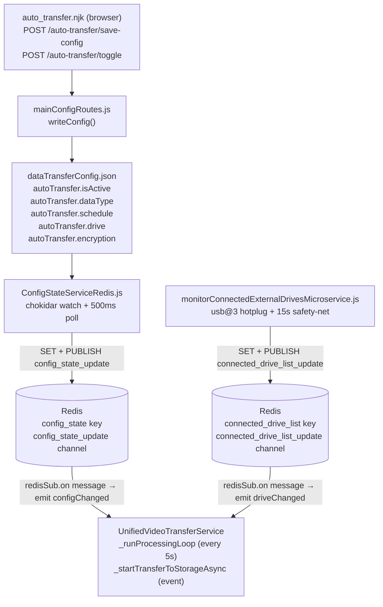
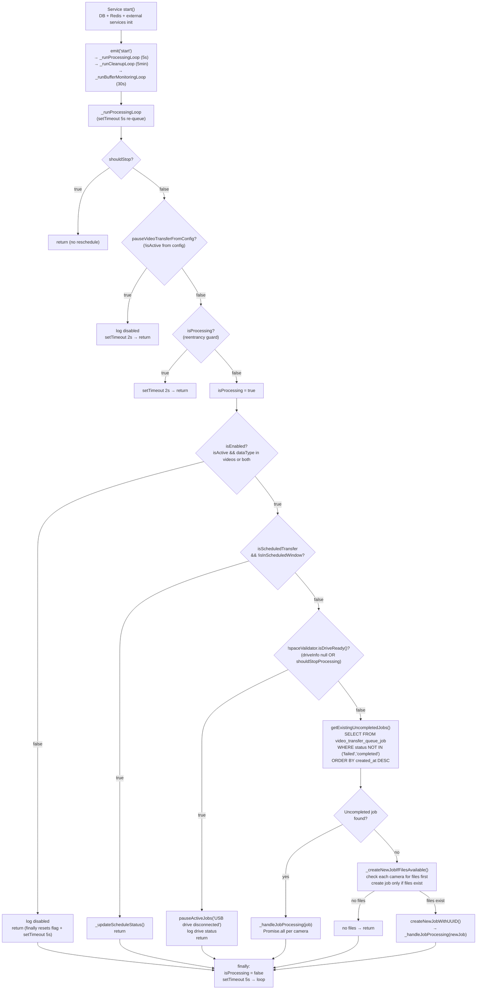
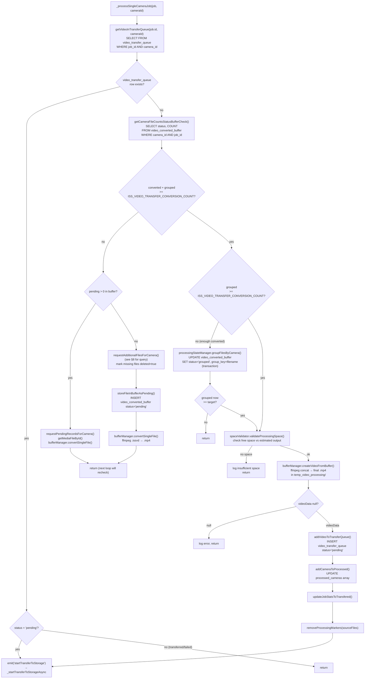
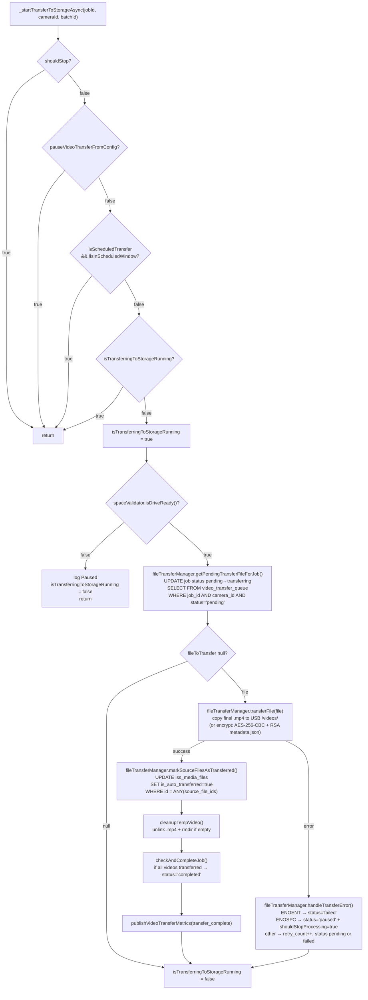
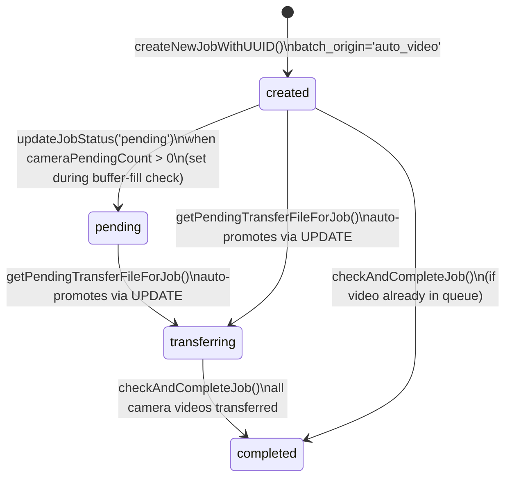
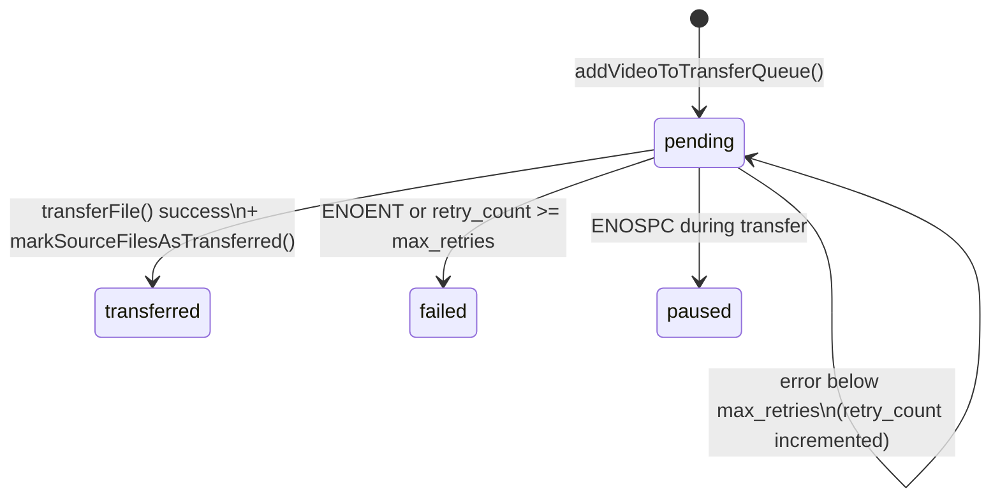
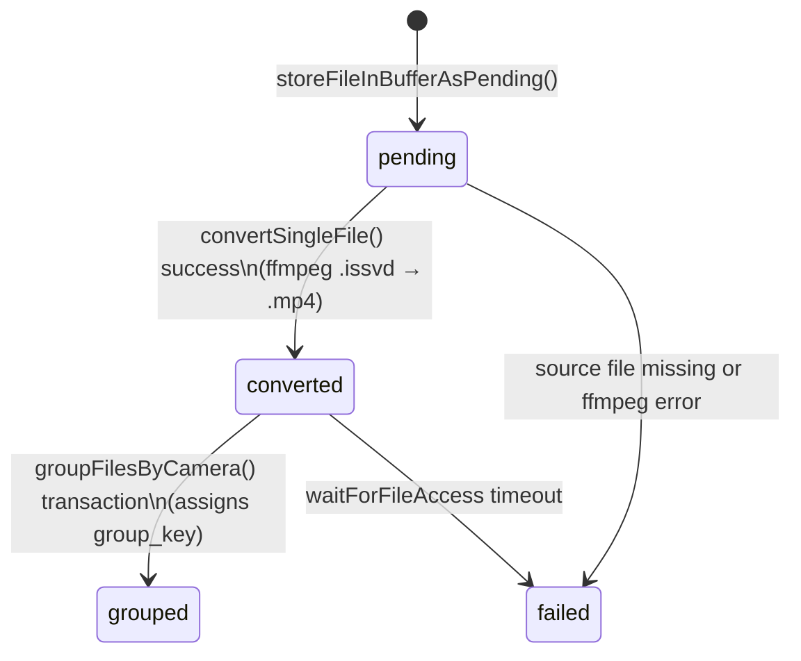

# USB Video Transfer Service — Activity & Behaviour Map

**Service**: `refactored_autoVideoTransferEDAMicroservice.js`  
**Class**: `UnifiedVideoTransferService extends EventEmitter`  
**PM2 log file prefix**: `video-usb-pipeline`  
Last updated: 2026-06-22

_Companion to `FILES_VIDEOS_AUTO_TRANSFER_MAP.md` and the project-level `PROJECT_MAP.md`. Covers the complete USB video transfer pipeline — control-plane architecture, processing loop gates, USB connect/disconnect handling, resume semantics, the 5-phase file pipeline, error handling, state machines, and known open issues. No code changes are described here._

---

## 1. Scope

This document covers **pipeline #3** in `FILES_VIDEOS_AUTO_TRANSFER_MAP.md`:

| Service | Source table | Destination | Queue tables | Done flag |
|---|---|---|---|---|
| `refactored_autoVideoTransferEDAMicroservice.js` | `iss_media_files` | USB drive (`G:\` etc.) | `video_transfer_queue_job` / `video_transfer_queue` / `video_converted_buffer` | `iss_media_files.is_auto_transferred` |

FTP video, USB image, and FTP image pipelines are out of scope except where referenced for comparison.

---

## 2. Control-Plane Architecture

How a UI click reaches the service:



**Key difference from the image pipeline**: this service uses **EventEmitter + `setTimeout` re-queuing** instead of a `while(true)` loop. Config/drive updates arrive via Redis pub/sub and are applied immediately via event handlers (`_handleConfigChanged`, `_handleDriveChanged`), not on the next loop iteration.

**Propagation latency**: same as image pipeline — chokidar fires within ms; `ConfigStateServiceRedis` publishes every 500 ms → ≤ 1 s end-to-end.

---

## 3. Three Concurrent Loops

On service start, the `'start'` event fires `_handleStart`, which launches three independent loops:

| Loop | Interval | Status |
|---|---|---|
| `_runProcessingLoop` | 5 s | **Active** |
| `_runCleanupLoop` | 5 min | **Active** — `if(true)` guard removed 2026-06-22; CleanupService made job-aware |
| `_runBufferMonitoringLoop` | 30 s | **Active** — `if(true)` guard removed 2026-06-22; `checkReadyGroupsInBuffer` crash fixed |

Transfer to USB is **event-driven** — not part of the processing loop. `emit('startTransferToStorage', jobId, cameraId, batchId)` is emitted from `_processSingleCameraJob` when a video is ready, and handled by `_startTransferToStorageAsync`.

---

## 4. Processing Loop Activity Diagram

`_runProcessingLoop` runs every 5 seconds. Each invocation goes through sequential gates before doing any file work.



---

## 5. Per-Camera Processing (`_processSingleCameraJob`)

`_handleJobProcessing` runs `_processSingleCameraJob` for every camera in `ISS_MEDIA_CAMERAS` simultaneously via `Promise.all`. Each camera follows an independent 5-phase pipeline:



---

## 6. Transfer to USB (`_startTransferToStorageAsync`)

Triggered by `emit('startTransferToStorage', jobId, cameraId, batchId)`:



---

## 7. Start / Stop Control

### 7.1 Toggle (`isActive`)

The UI sends `POST /auto-transfer/toggle`. `mainConfigRoutes.js` → `writeConfig()` → `dataTransferConfig.json`. `ConfigStateServiceRedis.js` publishes to `config_state_update`. The service receives `emit('configChanged')` → `_updateServiceConfig()` → sets:

```
pauseVideoTransferFromConfig = !serviceConfig.autoTransfer.isActive
```

When `true`, `_runProcessingLoop` returns at gate G2 with `setTimeout 2s`. Unlike the image service, there is **no explicit `pauseActiveJobs()` call** — the job status in the DB is not updated.

### 7.2 Data-type gate

```
isEnabled = isActive && ['videos', 'both'].includes(dataType)
```

If `dataType` is `images`, `isEnabled` is false → processing loop returns at gate G4.

### 7.3 Schedule gate

| `schedule.type` | Behaviour |
|---|---|
| `continuous` (default) | `isScheduledTransfer = false` → gate G5 skipped, loop runs every 5 s |
| `scheduled daily` | Active for **2-hour window** from `schedule.hour:00` |
| `scheduled weekly` | Active for **4-hour window** on `schedule.dayOfWeek` at `schedule.hour:00` |

Outside a scheduled window the loop returns early; `_updateScheduleStatus()` recomputes `nextScheduledRun`.

### 7.4 Drive gate

`spaceValidator.isDriveReady()` returns `driveInfo !== null && !shouldStopProcessing`. On disconnect: both conditions fail → loop returns at gate G6.

### 7.5 Space gate

`minRequiredSpaceMB` (default **500 MB**). If `freeSpaceMB ≤ minRequiredSpaceMB`, `shouldStopProcessing = true` → same gate G6 blocks processing. During transfer, `ENOSPC` sets `video_transfer_queue.status='paused'` and also sets `shouldStopProcessing = true`.

---

## 8. USB Connect / Disconnect

### Detection path

Same infrastructure as the image pipeline:
1. `monitorConnectedExternalDrivesMicroservice.js` — `usb@3` hotplug at +400 ms, +1200 ms, +3000 ms after event.
2. 15-second safety-net `setInterval(() => triggerReconcile(), 15000)`.
3. Publishes `CONNECTED_DRIVE_LIST` to Redis + fires `connected_drive_list_update`.

The video service receives via `redisSub.on('message')` → `emit('driveChanged')` → `_updateDriveInfo()`.

### Effect on the video service (disconnect)

```
_updateDriveInfo() →
  isDriveConnected = false
  shouldStopProcessing = true
  spaceValidator.updateDriveInfo(null, true)   → isDriveReady() = false
  fileTransferManager.setDriveInfo(null)        → next transferFile() throws "Drive information not available"

_runProcessingLoop (every 5 s) →
  gate G6: !isDriveReady() →
    jobManager.pauseActiveJobs('USB drive disconnected')
      → UPDATE video_transfer_queue_job SET status='paused'
        WHERE status IN ('created','pending','transferring')
    return
```

The active job in `video_transfer_queue_job` is updated to `status = 'paused'` on the next loop iteration (within 5 s).

### Effect on the video service (reconnect)

```
_updateDriveInfo() →
  isDriveConnected = true
  shouldStopProcessing = false (if free space > 500 MB)
  spaceValidator.updateDriveInfo(driveInfo, false)  → isDriveReady() = true
  fileTransferManager.setDriveInfo(driveInfo)
  jobManager.resumeActiveJobs()
    → UPDATE video_transfer_queue_job SET status='created'
      WHERE status='paused' AND batch_origin='auto_video'
```

The next 5-second loop iteration passes gate G6 and calls `getExistingUncompletedJobs()`, finding the job now in `created` status and resuming normally.

---

## 9. How Resume Works

Resume is **job-level**: uncompleted jobs persist in `video_transfer_queue_job` and are resumed on the next successful loop iteration.

### Resume invariants

| State at disconnect | What happens on resume |
|---|---|
| Job `created`/`pending`/`transferring` (during disconnect) | `_updateDriveInfo` → `resumeActiveJobs()` sets status back to `created`; next loop iteration picks it up via `getExistingUncompletedJobs` and resumes the pipeline |
| Job `paused`, buffer partially filled | `_processSingleCameraJob` picks up where each camera left off (`pending`/`converted`/`grouped` buffer rows intact) |
| Job `paused`, video in `video_transfer_queue` with `pending` | `getVideoInTransferQueue` finds it → `emit('startTransferToStorage')` re-triggers the file copy |
| Job `completed` | Excluded by `getExistingUncompletedJobs` (status NOT IN ('failed','completed')); a new job is created if files are available |
| Toggle off → toggle on | `pauseVideoTransferFromConfig` flips false; next 5-second loop passes gate G2 and resumes normally |

### Redis processing markers

`ProcessingStateManager` uses Redis keys `video_processing_in_progress:<fileId>` (TTL 3600 s) to prevent the same file being added to the buffer twice concurrently. On reconnect, markers for files already in `video_converted_buffer` remain until TTL expires or processing completes.

---

## 10. Continuous / Scheduled Mode

**Continuous** (`schedule.type = 'continuous'`, the default):
- `isScheduledTransfer = false` → gate G5 never blocks
- Processing runs every 5 s as long as files exist and drive is ready

**Scheduled**:
- `schedule.type = 'scheduled'`, `schedule.mode = 'daily'` or `'weekly'`
- Outside the window: loop returns at G5; cleanup and buffer monitoring also skip (they check the same window)
- Inside the window: normal processing resumes

---

## 11. File Selection and 5-Phase Pipeline

### Source query (`requestAdditionalFilesForCamera`)

```sql
SELECT imf.*
FROM iss_media_files imf
WHERE imf.camera_id = $1
  AND imf.deleted = false
  AND imf.is_auto_transferred = false
  AND imf.recording_date >= CURRENT_DATE - INTERVAL '7 days'
  AND imf.id NOT IN (
      SELECT DISTINCT unnest(source_file_ids)
      FROM video_transfer_queue
      WHERE status IN ('pending', 'transferred', 'converted')
  )
  AND imf.id NOT IN (
      SELECT DISTINCT source_file_id
      FROM video_converted_buffer
      WHERE status IN ('pending', 'converted', 'grouped')
  )
ORDER BY imf.recording_date ASC, imf.precise_time ASC
LIMIT $2
```

**Key properties:**
- **7-day window** — only files from the last 7 days. Older recordings are never processed by this service.
- **Oldest first** — `ORDER BY recording_date ASC, precise_time ASC`. This is the opposite of the image pipeline (which is newest-first).
- **Double de-duplication** — excludes files already in `video_transfer_queue` (queued/done) or `video_converted_buffer` (being/been converted).
- **2× over-request** — queries `min(needed × 2, 100)` candidates to account for files missing on disk. Missing files are marked `deleted=true` in a batch UPDATE.
- **Target**: `ISS_VIDEO_TRANSFER_CONVERSION_COUNT` valid files per camera (default **10**, env-configurable).

### 5-phase pipeline

| Phase | Where | Table/Path | Status transition |
|---|---|---|---|
| **1. Fetch** | `requestAdditionalFilesForCamera` | `iss_media_files` → `video_converted_buffer` | `is_auto_transferred=false` → buffer row `pending` |
| **2. Convert** | `bufferManager.convertSingleFile` | `video_converted_buffer` + `temp_video_processing/temp_cam_N/` | `pending` → `converted` (ffmpeg `.issvd` → `.mp4`) |
| **3. Group** | `processingStateManager.groupFilesByCamera` | `video_converted_buffer` | `converted` → `grouped` (assigns `group_key` = `cam_N_date___time1--time2`) |
| **4. Concat** | `bufferManager.createVideoFromBuffer` | `temp_video_processing/temp_cam_N/` | ffmpeg concat N× `.mp4` → 1 final `.mp4`; individual segments deleted |
| **5. Transfer** | `fileTransferManager.transferFile` | `video_transfer_queue` | `pending` → `transferred`; `iss_media_files.is_auto_transferred=true` |

### ffmpeg commands

**Convert** (phase 2):
```
ffmpeg -f h264 -i <source.issvd> -c:v copy -f mp4 <output.mp4> -y
```

**Concat** (phase 4):
```
ffmpeg -f concat -safe 0 -i concat_list_<ts>.txt -c copy -avoid_negative_ts make_zero <final.mp4> -y
```

### Ordering comparison

| Pipeline | Date window | Order | Batch unit |
|---|---|---|---|
| USB image | None (full backlog) | `MIN(date+time) DESC` — newest first | Plate-group of exactly 3 |
| USB video | Last **7 days** | `recording_date ASC, precise_time ASC` — oldest first | Per-camera, `ISS_VIDEO_TRANSFER_CONVERSION_COUNT` segments |

---

## 12. Error Handling Reference

### Conversion errors (phase 2 — `convertSingleFile`)

| Error | Detection | Action |
|---|---|---|
| Source `.issvd` missing | `fs.pathExists` pre-check | Mark `iss_media_files.deleted=true`; mark buffer `failed`; increment `videoStats.errorsCount` |
| ffmpeg exit code ≠ 0 | `ffmpeg.on('close', code)` | `markBufferEntryAsFailed(bufferId, message)` |
| Output file not accessible after conversion | `waitForFileAccess` timeout (5 s) | Reject → caught by `convertSingleFile` catch → `markBufferEntryAsFailed` |

### Transfer errors (phase 5 — `handleTransferError`)

| Error | Detection | Action |
|---|---|---|
| Source video missing | `ENOENT` | `video_transfer_queue.status = 'failed'`, `error_message` set |
| No space on USB | `ENOSPC` | `video_transfer_queue.status = 'paused'`; `shouldStopProcessing = true` → blocks all future iterations via gate G6 |
| Drive not available | `driveInfo` null check in `transferFile` | Throws "Drive information not available" → caught → `handleTransferError` → retry logic |
| `EBUSY` on copy | `copyWithRetry` catches `EBUSY` | Retries up to 3 times with 1000 ms delay before re-throwing |
| Any other error | Generic catch | `retry_count++`; `status = 'failed'` when `retry_count >= max_retries` (default 3); else stays `pending` |

### Service-level error handler

```js
this.on('error', (error) => {
    logger.error('[EVENT] Service error:', { error: error.message, stack: error.stack });
    this.bufferManager?.getVideoStats()?.errorsCount++;
});
```

Errors propagate via `this.emit('error', error)` from event handlers. Errors inside `_runProcessingLoop`'s `try/catch` are emitted to this handler; the `finally` block always reschedules the loop.

---

## 13. State Machines

### Job (`video_transfer_queue_job`)



> There is no explicit `paused` state for jobs in the video service. Disconnect stops the loop at gate G6 but leaves the job in its current status.

### Video queue row (`video_transfer_queue`)



### Buffer row (`video_converted_buffer`)



---

## 14. Observations and Open Issues

### V-A — Cleanup and buffer-monitoring loops re-enabled (fixed 2026-06-22)

**Original state:** Both `_runCleanupLoop` and `_runBufferMonitoringLoop` contained an unconditional `if (true) { …; return; }` guard that made every invocation exit immediately. `CleanupService.runAllCleanupTasks()` and `checkReadyGroupsInBuffer()` were never called.

**What was fixed (3 files changed):**

**`refactored_autoVideoTransferEDAMicroservice.js`**
- Removed `if (true) { … return; }` guard from `_runCleanupLoop`
- Removed `if (true) { … return; }` guard from `_runBufferMonitoringLoop`
- Fixed reschedule bug in `_runBufferMonitoringLoop` disabled-return (was calling `this._runCleanupLoop()` with 300 000 ms; corrected to `this._runBufferMonitoringLoop()` with 30 000 ms)

**`services/shared/CleanupService.js`** — three sub-tasks made job-aware before enabling:
- `cleanupStaleBufferEntries`: both the file-deletion SELECT and the DELETE now exclude rows whose `job_id` is in a currently-active job (`status IN ('created','transferring','paused')`), preventing mid-pipeline segment files from being deleted during slow conversions.
- `cleanupTempVideoFiles`: loads all `video_file_path` values from `video_transfer_queue WHERE status = 'pending'` at the start of each run; any file or directory that matches a pending transfer is skipped, so a queued-but-not-yet-transferred video is never deleted beneath an active copy.
- `cleanupStaleProcessingMarkers`: before deleting a stale Redis marker (>2 h old), extracts the `fileId` from the key suffix and checks `video_converted_buffer` for that `source_file_id` with `status IN ('pending','converted')`; if found, the marker is left in place to prevent the slow-converting file from being eligible for double-pickup by the processing loop.

**`services/video-transfer/processors/CompleteBufferManager.js`** — `checkReadyGroupsInBuffer` crash fixed:
- Undefined `jobId` variable: fixed by querying the active job (`status IN ('created','transferring','paused')`) before the `for` loop; the method returns early if no active job exists.
- Post-creation code: replaced call to non-existent `jobManager.getOrCreateActiveJob()` with the already-fetched `activeJob`; fixed `addVideoToTransferQueue(videoData, job)` (wrong object) to `addVideoToTransferQueue(videoData, activeJob.id)`; replaced `emit('videoCreated', …)` (which would hit the V-F crash) with `emit('startTransferToStorage', activeJob.id, videoData.camera_id, activeJob.batch_id)`, matching the pattern used by `_processSingleCameraJob`.

### V-B — Drive disconnect job status fixed (2026-06-23)

**Original state:** Gate G6 in `_runProcessingLoop` returned early without touching the DB. The active job stayed in `created`/`pending`/`transferring` while no processing was happening, causing monitoring confusion.

**What was fixed (2 files changed):**

**`services/video-transfer/state/JobManager.js`** — two new batch methods added after `updateJobStatus`:
- `pauseActiveJobs(reason)` — sets `status = 'paused'` for all jobs with `status IN ('created','pending','transferring') AND batch_origin = 'auto_video'`; stores `reason` in `error_message`. Idempotent (SQL returns 0 rows when already paused).
- `resumeActiveJobs()` — restores `status = 'created'` for all `paused` jobs with `batch_origin = 'auto_video'`; clears `error_message`. Idempotent (SQL returns 0 rows when no paused jobs).

**`refactored_autoVideoTransferEDAMicroservice.js`** — two call sites wired:
- Gate G6 (`!isDriveReady()`): `await this.jobManager.pauseActiveJobs('USB drive disconnected')` added before the early `return`. Called every 5 s — idempotent.
- `_updateDriveInfo` reconnect branch (`if (targetDrive)`): `await this.jobManager.resumeActiveJobs()` added after `fileTransferManager.setDriveInfo`. Called with `jobManager` null-guard (`if (this.jobManager)`).

**Verification query** (status should show `paused` while drive is absent, `created` after reconnect):

```sql
SELECT id, batch_id, status, error_message, updated_at
FROM video_transfer_queue_job
WHERE batch_origin = 'auto_video'
  AND status NOT IN ('completed', 'failed')
ORDER BY updated_at DESC;
```

### V-C — `isTransferringToStorageRunning` flag leaks `true` on early returns — **Fixed (2026-06-23)**

**Root cause**: `isTransferringToStorageRunning = true` was set at the top of `_startTransferToStorageAsync` before two early-return guards that never reset it:

1. **Drive-not-ready path**: if the drive became unavailable between the `AlreadyRunning` check (flag still `false`) and the `isDriveReady()` call (e.g. rapid disconnect), the flag was left `true` permanently.
2. **No-file path**: if `getPendingTransferFileForJob` returned `null`, the flag was also left `true`.

All subsequent `startTransferToStorage` events short-circuited at the `AlreadyRunning` guard, blocking the entire transfer path until service restart. The three correct reset points (catch block, after `runWithTrace`) were never reached via either early-return path.

**Fix** (`refactored_autoVideoTransferEDAMicroservice.js`): Added `this.isTransferringToStorageRunning = false;` before both early returns:

```js
if (!this.spaceValidator.isDriveReady()) {
    const driveStatus = this.spaceValidator.getDriveStatus();
    logger.warn(`[TRANSFER TO STORAGE] Paused: ${driveStatus.reason}`);
    this.isTransferringToStorageRunning = false;   // reset before return
    return;
}

const fileToTransfer = await this.fileTransferManager.getPendingTransferFileForJob(jobId, cameraId);

if (!fileToTransfer) {
    this.isTransferringToStorageRunning = false;   // reset before return
    return;
}
```

The flag is now correctly released on every exit path of the method.

### V-D — Duplicate `checkJobVideoTransferCompletion` definition — **Fixed (2026-06-23)**

**Root cause**: `JobManager` defined `checkJobVideoTransferCompletion` twice. In a JavaScript class body the second definition silently wins:

- **First definition (lines 166–186) — correct semantics**: counted `transferred + failed` rows in `video_transfer_queue`, returning `true` when `totalProcessedCount >= ISS_MEDIA_CAMERAS.length`. Genuine transfer-completion check.
- **Second definition (lines 614–667) — wrong semantics**: queried `video_converted_buffer` file counts, returning `true` when *any* camera had `>= ISS_VIDEO_TRANSFER_CONVERSION_COUNT` buffer files. This is a buffer-readiness check, not a transfer-completion check, and was incorrectly named.

The surviving (second) definition could cause premature `pending` status transitions — a job flagged complete while videos were still converting, not yet transferred.

Both call sites (`getOrCreateActiveJob` line 43 and `_handlePendingProcessingJobStatus` in the main service) are dead code: the active loop uses `getExistingUncompletedJobs` → `_handleJobProcessing` → `_processSingleCameraJob` and never reaches either caller.

**Fix** (`services/video-transfer/state/JobManager.js`): Deleted the entire second definition (lines 611–667, including its JSDoc comment). The correct first definition is now the sole surviving implementation. No call-site changes were needed.

### V-E — `processFilesToBuffer` references undefined variables — **Fixed (2026-06-23)**

**Root cause**: `CompleteBufferManager.processFilesToBuffer(group, jobId)` used `camera_id`, `date`, `group_key`, `interval_start`, `interval_end` as bare variables without destructuring `group`. The method would throw `ReferenceError: camera_id is not defined` on its first line if called. The method was dead code (the `filesReady` event is never emitted from the active path), but the event listener is registered and `_handleFilesReady` calls `bufferManager.processFilesToBuffer(group, job.id)` at line 352 of the main service.

**Fix** (`services/video-transfer/processors/CompleteBufferManager.js`): Added one destructuring line immediately inside `try {`:

```js
async processFilesToBuffer(group, jobId) {
    try {
        const { camera_id, date, group_key, interval_start, interval_end } = group;
        const isReady = await this.checkCameraGroupReady(camera_id, date, group_key);
        // ...
        const videoData = await this.createVideoFromBuffer(jobId, camera_id, date, group_key, interval_start, interval_end);
```

Downstream call signatures are correct: `checkCameraGroupReady(cameraId, date, groupKey)` matches the call exactly; `createVideoFromBuffer(jobId, cameraId)` only uses the first two arguments — the remaining four are silently ignored. Note: V-F (`videoCreated` → `updateJobStats` crash) remains open on this path.

### V-F — `_handleVideoCreated` calls `updateJobStats` which does not exist on `JobManager`

```js
// _handleVideoCreated (line ~376)
await this.jobManager.updateJobStats(jobId);   // ← method does not exist
```

`JobManager` only defines `updateJobStatsToTransfered` (with a typo). Calling `updateJobStats` would throw `TypeError: this.jobManager.updateJobStats is not a function`.

The `'videoCreated'` event that triggers this handler is emitted only from:
1. `CompleteBufferManager.processFilesToBuffer` → dead code (V-E)
2. `CompleteBufferManager.checkReadyGroupsInBuffer` → **the V-A fix changed this path to emit `startTransferToStorage` instead of `videoCreated`**, so this route is now closed

This path is **still unreachable** via normal operation. If `processFilesToBuffer` (V-E) is ever repaired and called, V-F would produce a runtime crash.

---

## 15. Key Constants and Configuration

| Item | Default / Source |
|---|---|
| Processing loop interval | 5 000 ms |
| Cleanup loop interval | 300 000 ms (5 min) |
| Buffer monitoring loop interval | 30 000 ms |
| Files per camera per job | `ISS_VIDEO_TRANSFER_CONVERSION_COUNT` (default 10) |
| File selection date window | Last 7 days |
| File selection order | Oldest first (`recording_date ASC, precise_time ASC`) |
| Over-request multiplier | 2× (max 100) for disk-existence check |
| Min required space | `minRequiredSpaceMB` = 500 MB |
| Space buffer for estimate | 120 MB fixed + 25% of estimated output |
| EBUSY retries | 3 × 1 000 ms |
| General max retries | 3 per `video_transfer_queue` row |
| Processing marker TTL | 3 600 s (1 hour) |
| Stale marker cleanup threshold | 2 hours |
| ffmpeg wait-for-access timeout | `waitFileAccessTimeout` (default 5 000 ms) |
| ffmpeg concat: negative-ts fix | `-avoid_negative_ts make_zero` |
| Encryption (optional) | AES-256-CBC + RSA-wrapped `<name>_metadata.json` per video |
| Redis metrics channel | `usb_video_transfer_metrics` |
| Drive hotplug reconcile delays | 400 ms, 1 200 ms, 3 000 ms |
| Drive safety-net interval | 15 000 ms |
| Config propagation latency | ≤ 1 s (chokidar + 500 ms poll) |
| Schedule daily window | 2 hours from `schedule.hour:00` |
| Schedule weekly window | 4 hours from `schedule.hour:00` |

---

## 16. Verification Pointers

| Symptom | Where to check |
|---|---|
| Videos never appear on USB | Confirm `is_auto_transferred=false` files in `iss_media_files` within last 7 days; check `video_converted_buffer` for `failed` rows (conversion errors) |
| Conversions failing | Check logs `[VIDEO_CONVERT_ERROR]`; confirm `ffmpeg` is in PATH; check source `.issvd` files exist on disk |
| Transfer path permanently blocked | V-C: check if `isTransferringToStorageRunning` leaked — logs show "Transfer is already running" on every `startTransferToStorage` event; restart service to reset |
| Job shows `created`/`transferring` but no activity | V-B: drive may be disconnected; check `connected_drive_list` Redis key; `isDriveConnected` flag is not reflected in job status |
| Buffer rows accumulating (status `pending`/`converted`) | V-A: cleanup loop is disabled; manually query `video_converted_buffer` and clean stale rows for completed/failed jobs |
| `temp_video_processing/` growing on disk | V-A: buffer monitoring disabled; individual `.mp4` segments not cleaned on interrupted jobs |
| Job completes too early or never completes | V-D: duplicate `checkJobVideoTransferCompletion` — the active version checks buffer counts, not actual transfer status |
| `ReferenceError: camera_id is not defined` | V-E: `processFilesToBuffer` dead code was reached — trace which event triggered `filesReady` |
| `TypeError: updateJobStats is not a function` | V-F: `_handleVideoCreated` was reached — `videoCreated` event was emitted from a re-enabled loop |

---

_Sources: `refactored_autoVideoTransferEDAMicroservice.js`, `services/video-transfer/state/JobManager.js`, `services/video-transfer/transfer/FileTransferManager.js`, `services/video-transfer/validators/SpaceValidator.js`, `services/video-transfer/processors/CompleteBufferManager.js`, `services/video-transfer/processors/VideoProcessor.js`, `services/video-transfer/state/ProcessingStateManager.js`, `services/shared/CleanupService.js`, `monitorConnectedExternalDrivesMicroservice.js`, `ConfigStateServiceRedis.js`, `redisKeyStore.js`, `routes/mainConfigRoutes.js`, `data_transfer_v2/views/auto_transfer.njk`. Last updated: 2026-06-23 (V-B fixed — drive disconnect now sets job status to paused; reconnect resumes to created via new pauseActiveJobs/resumeActiveJobs methods in JobManager)._
